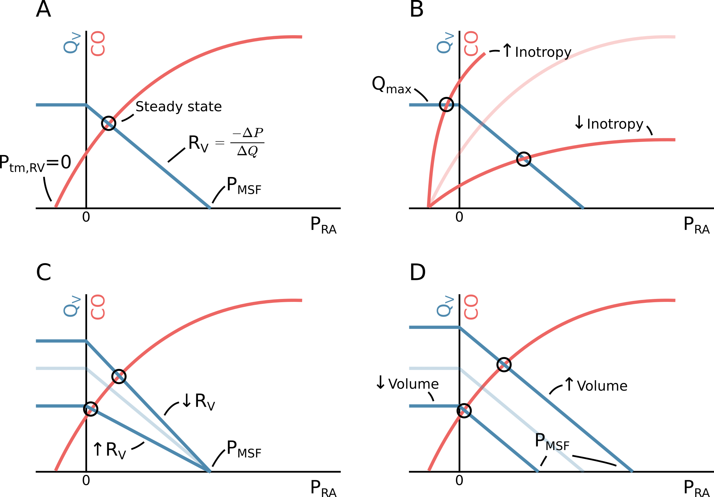

---
#########################################
# options for knitting a single chapter #
#########################################
output:
  bookdown::pdf_document2:
    template: templates/brief_template.tex
    citation_package: biblatex
  bookdown::html_document2: default
  bookdown::word_document2: default
documentclass: book
#bibliography: [bibliography/references.bib, bibliography/additional-references.bib]
---

```{block type='savequote', quote_author='(ref:lewins-quote)', echo=TRUE, include=knitr::is_latex_output()}
"The most wonderful and satisfactory effect is the immediate consequence of the injection [of fluid]. To produce the effect referred to, a large quantity must be injected---from five to ten pounds in an adult—and repeated at longer or shorter intervals, as the state of the pulse, and other symptoms, may indicate."
```

(ref:lewins-quote) --- **Robert Lewins, M.D.**, 1832 (Injection of Saline Solutions Into the Veins).

# Background

## History

Intravenous fluid therapy first became popular in the cholera epidemic around 1830, when Thomas Latta "threw" several litres of saline into the veins of severely dehydrated cholera patients, and Robert Lewins reported enthusiastically on the "most wonderful and satisfactory effect" [@lewinsInjectionSalineSolutions1832; @lattaMALIGNANTCHOLERADOCUMENTS1832]. After the end of the epidemic, the treatment was mostly abandoned. Possibly because the early clinical reports from the epidemic mainly presented temporary effects and mostly in morbidly dehydrated patients, and also because the concerns raised by sceptics were probably highly relevant: the fluid was both unsterile and hypotonic [@cosnettOriginsIntravenousFluid1989]. 

Interest in fluid resuscitation reemerged nearly 50 years later, in 1879, when Kronecker and Sander demonstrated the importance of volume (as opposed to red blood cells) in the treatment of haemorrhage: They bleed down two dogs until bleeding stopped from lack of cardiac activity (approx. 50 % of the blood volume). Then, they reported how resuscitation with an equivalent volume of a saline solution would recover the animals’ cardiac activity [@petroianuSalineInfusionClonus2021; @foexHowCholeraEpidemic2003]. This was followed by a number of reports of successful IV fluid resuscitations in humans [@foexHowCholeraEpidemic2003]. 

Since the end of the nineteenth century, IV fluid administration has been a staple in the treatment of the acutely ill and during surgery. With better equipment and hygiene, the safety of IV fluid administration has increased, and the indication for treatment has widened accordingly---today, IV fluid is even available as a drop-in or home-delivery hangover remedy [@kadetHouseCallsHangovers2015]. Naturally, debates about the appropriate use of IV fluids continue. 

## Why give IV fluids? {#why-fluid}

Fluid should only be administered when the patient is likely to benefit from it [@millerPerioperativeFluidTherapy2019]. As a treatment for hypovolemia, the goal is that the infused fluid will increase the circulating volume and thereby the mean systemic pressure. This gives an increase in cardiac preload and, through the Frank-Starling mechanism (see section \@ref(frank-starling)), an increase in CO. This should increase microcirculation and, in turn, the oxygen available to organs, increasing (or retaining) organ function (see Figure \@ref(fig:background-monnet2018-aic-fluid2organ)) [@monnetMyPatientHas2018]. As discussed in section \@ref(fluid-bolus-physiology), this goal is not always achieved.

```{r background-monnet2018-aic-fluid2organ}
#| out.width="14cm",
#| fig.cap="(ref:background-monnet2018-aic-fluid2organ)",
#| fig.scap="Steps from fluid administration to benefit"
knitr::include_graphics("figures/background-monnet2018-aic-fluid2organ.png")
```

(ref:background-monnet2018-aic-fluid2organ) Illustration of the physiological steps from fluid administration to benefit. Reprinted from Monnet et al, 2018 [@monnetMyPatientHas2018] ([CC BY](https://creativecommons.org/licenses/by/4.0/)).

Another common aim with IV fluid therapy is to resuscitate dehydration, characterised by hypertonicity (excess salt) due to loss of water---e.g., due to gastroenteritis or diabetic polyuria. While hypovolemia can be corrected rapidly with IV infusion of an isotonic fluid, hypertonicity should be corrected slowly through oral intake of water or with IV hypotonic fluid [@bhaveVolumeDepletionDehydration2011]. This dissertation focuses on fluid as a treatment of hypovolemia, and dehydration/hypertonicity will not be discussed further.

During surgery, there is a continuous loss of circulation fluid through urination, bleeding, perspiration and *redistribution*. If this fluid is not replaced, the patient will gradually become hypovolemic and, eventually, organ failure will occur. Since blood loss and urination is accurately recorded throughout the surgery, the unknown volume of fluid to replace is from perspiration and redistribution [@jacobThirdSpaceFact2009]. An additional unknown is the patient’s fluid status on arrival to the operating room. Preoperative hypovolemia due to extended fasting before operations used to be a relevant concern, and was treated with significant volumes of fluid during or before induction of anaesthesia [@jacobThirdSpaceFact2009; @coeCrystalloidPreloadingUseful1990]. With today’s more liberal guidelines for pre-surgery fluid intake, allowing clear fluids until two hours before surgery, the preoperative deficit is probably lower [@millerPerioperativeFluidTherapy2019; @smithPerioperativeFastingAdults2011; @jacobThirdSpaceFact2009].

With the risk of organ failure from hypovolemia, why not simply give the patient some extra fluid to ensure that there is enough?

## Concerns about liberal use of IV fluids 

The statement that IV fluid administration should be treated as any other prescription medication has become a trope in fluid resuscitation literature [@millerPerioperativeFluidTherapy2019; @myburghResuscitationFluids2013; @hosteFourPhasesIntravenous2014; @malbrainIntravenousFluidTherapy2020]. For good reasons. In addition to the intended effect summarised in the section above, fluid administration can cause side effects. The principal concerns with excessive fluid administrations can be divided into hypervolemia and non-volume-related effects. The non-volume-related effects depend on the type of fluid. Notable examples include hyperchloremic acidosis from normal saline and kidney injury associated with hydroxyethyl-starch (HES) infusion [@myburghResuscitationFluids2013; @pernerHydroxyethylStarch1302012]. Hypervolemia is a more general issue with excessive fluid administration, causing oedemas of tissue and lungs. The pathophysiology of hypervolemia involves both cardiovascular mechanics and endothelial function, so this will be a good place for an introduction to the physiology of fluid administrations. 

## The physiology and pathophysiology of a fluid bolus {#fluid-bolus-physiology}

A fluid bolus should increase stroke volume (SV) and, hence, CO. This requires that the fluid remains in circulation to increase cardiac preload, and that this increase in cardiac preload causes an increase in SV. We will start with the latter condition: the Frank-Starling mechanism.

### The Frank-Starling mechanism {#frank-starling}

The relation between cardiac preload and SV is often termed the "Frank-Starling mechanism" or the "Frank-Starling law of the heart", after Otto Frank and Ernest Starling, who are commonly attributed the discovery of the relationship [@frankDynamicsCardiacMuscle1895; @pattersonRegulationHeartBeat1914]. It has been noted, though, that the phenomenon had been observed several decades earlier [@zimmerWhoDiscoveredFrankStarling2002]. The Frank-Starling mechanism describes that increasing the length of a cardiomyocyte will increase the force generated when the muscle is activated; or, as a consequence, that increased filling of a ventricle will increase stroke volume. The relation occurs only until a certain length/volume, where the curve flattens and the effect eventually reverses. This was clearly demonstrated in experiments by Otto Frank, where he measured the pressure generated through isovolumetric contractions of frog hearts (see Figure \@ref(fig:background-frank1895)). A number of cellular mechanisms for this length-force relationship has been proposed, but the most important contributors seems to be the following: When cardiac sarcomeres are stretched, the lateral distance between actin and myosin decreases, which increases cross-linking between the filaments and increases Ca^++^ sensitivity. Also, stretching cardiac myocytes increase their Ca^++^ permeability. The drop in force with further stretching has been attributed to a decreasing overlap between filaments, though this mechanism is controversial [@boronHeartPump2016]. 

```{r background-frank1895}
#| out.width="12cm",
#| fig.cap="(ref:background-frank1895)",
# fig.scap="Otto Frank's tracings"

```

(ref:background-frank1895) Otto Frank’s tracings of intraventricular pressure during isovolumetric contractions. In each panel, ventricular volume increases with the number on the tracing. Right panel, tracing 4 demonstrates the decrease in maximum pressure with overdistension. Reproduction of figures from Frank, 1895 [@frankDynamicsCardiacMuscle1895], public domain. 

A clinical consequence of the Frank-Starling mechanism is that a patient’s SV can only increase from a fluid bolus, if the heart is currently functioning on the rising section of the Frank-Starling curve (see Figure \@ref(fig:background-starling-curve)). A heart’s Frank-Starling curve is, however, not constant, but can be raised with higher sympathetic tone or sympathomimetic drugs (positive inotropes).

```{r background-starling-curve}
#| out.width="10cm",
#| fig.cap="(ref:background-starling-curve)",
# fig.scap="Illustration of the Frank-Starling mechanism"
knitr::include_graphics("figures/background-starling-curve.png")
```

(ref:background-starling-curve) Illustration of the Frank-Starling mechanism---the relation between the end-diastolic volume and the stroke volume. If end-diastolic volume is increased in a heart operating on the steep part of the curve (e.g. by a fluid bolus) stroke volume will increase. If the heart is already operating on the flat part of the curve, no increase in stroke volume can be expected.

A few concepts are used interchangeably for both the cause and the effect in the Frank-Starling relationship. Starling et al note that the physiological relationship must be between the length of a piece of cardiac muscle and the tension it exerts when it contracts, but, since they are not able to measure these in an intact heart, assume that ventricular  volume is linearly related to muscle length, and that ventricular pressure is linearly related to muscle tension. They appropriately note that this assumption will become increasingly incorrect with distension and a more globular shape of the ventrice [@pattersonRegulationHeartBeat1914]. Other terms used as proxies for end-diastolic muscle length are preload and end-diastolic pressure. Preload should be synonymous with end-diastolic volume or muscle length, but the term is often not well defined. End-diastolic pressure is of course related to muscle length, but it also depends on static mechanical factors (e.g. fibrosis), external pressure and the shape and size of the heart. Proxies for the systolic muscle tension include afterload, systolic ventricular pressure, stroke volume and mechanical work. 

### Venous return and mean systemic filling pressure

In steady state, blood circulates continuously from the heart to the arteries, through tissues, to the veins and back to the heart. The circulating volume is constant and CO is equal to the venous return to the heart. We can consider a simple model of this system, where blood is pumped from a small elastic compartment into a larger elastic compartment and returned again to the smaller elastic compartment through a tube (see Figure \@ref(fig:background-venous-return-simple)). The pump is the heart, the large compartment represents the capacitance of venules and veins---completely neglecting the capacitance of the arteries---and the smaller compartment represents the right atrium and large veins immediately upstream from the heart. Arteries are neglected in this model because of their low compliance relative to the venous system (for an illustration of how the arterial system would fit in this model, see Figure \@ref(fig:background-venous-return-art)) [@magderVolumeItsRelationship2016]. The pressure in the large compartment is the venous pressure ($P_V$), the pressure in the smaller compartment is the right atrial pressure ($P_{RA}$) and the resistance in the tube is the resistance to venous return ($R_V$). If the pump is stopped, both compartments will reach an equilibrium pressure: the mean systemic filling pressure ($P_{MSF}$). Often, $P_V$ is considered equal to $P_{MSF}$ in this model, since the right atrium and arteries have relatively small volumes, and therefore little impact on $P_{MSF}$.

```{r background-venous-return-simple}
#| out.width="8cm",
#| fig.cap="(ref:background-venous-return-simple)",
# fig.scap="Simple model of venous return"

```

(ref:background-venous-return-simple) A simple model illustrating the concepts of venous return ($Q_V$) and mean systemic filling pressure ($P_{MSF}$). The pressure is defined by the height of the fluid surface and the compliance is proportional to the width of the compartment. CO, cardiac output. $P_V$, pressure of the compartment representing venules and veins. $R_V$, resistance to venous return. $P_{RA}$, pressure of the compartment representing the right atrium.

```{r background-venous-return-art}
#| out.width="8cm",
#| fig.cap="(ref:background-venous-return-art)",
# fig.scap="The arterial system in the simple model of venous return"

```

(ref:background-venous-return-art) An illustration of how the arterial system could be represented in the simple model illustrated in Figure fig:background-venous-return-simple. MAP, mean arterial pressure.

From this simple model, we can appreciate some factors that determine CO. First, the heart's ability to pump is the absolute limitation to cardiac output. However, the heart also cannot pump more than what is returned from the veins. This venous return is determined by the resistance to venous return and the pressure difference between the venous compartment and the right atrial compartment:

$$
CO = Q_V = \frac{P_V - P_{RA}}{R_V}.
$$

\noindent Thus, increasing venous pressure or lowering resistance to venous return *allows* a higher CO. If venous compliance is constant, a fluid bolus can increase venous pressure. Alternatively, we can use an $\alpha$-adrenergic agonist such as noradrenaline to decrease venous compliance and thereby increase pressure without adding fluid (venoconstriction will also increase resistance to venous return, but the effect on compliance seems to dominate) [@persichiniVenousReturnMean2022]. Models of venous return often divide compartments into stressed volume and unstressed volume. The unstressed volume is the volume of fluid that will not create any pressure in the compartment---essentially the volume that will remain if the circulation is lacerated. Unstressed volume is effectively inert, and only the stressed volume has any influence on venous return. Unstressed volume can, however, become stressed through vasoconstriction. While the concept of unstressed volume makes sense anatomically (a vessel can be filled to a certain volume without exerting an elastic recoil), it will often be difficult to differentiate between the effects of *unstressed volume becoming stressed* and *a decrease in compliance of already stressed volume* (both increase $P_{MSF}$). 

As described in the section above, the Frank-Starling curve describes the relationship between ventricular filling and CO (via SV). Ventricular filling is positively related to the right atrial pressure, while the right atrial pressure is inversely related to CO, since a high CO will tend to empty the right atrial compartment. The right atrial pressure and CO where venous return and cardiac output are in equilibrium can be found as the intersection between the venous return curve (the relationship between venous return and right atrial pressure) and the Frank-Starling curve (a variant with CO rather than SV on the y-axis). This graphical solution, illustrated in Figure \@ref(fig:background-guyton), was first proposed by Arthur Guyton [@guytonVenousReturnVarious1957].

```{r background-guyton}
#| out.width="16cm",
#| fig.cap="(ref:background-guyton)",
# fig.scap="Guyton's venous return graph"

```

(ref:background-guyton) **A** The relationship between venous return ($Q_V$), right atrial pressure ($P_{RA}$) and cardiac output (CO). If CO (and hence $Q_V$) drops to zero, $P_{RA}$ will equal the mean systemic filling pressure ($P_{MSF}$). The circulation is at steady state at the intersection of the venous return function and the cardiac function (when $Q_V = CO$). This illustration corresponds to spontaneous breathing, where the intrathoracic pressure is negative. Therefore, the cardiac function starts at a negative pressure where the ventricular transmural pressure ($P_{tm,RV}$) is zero. **B** Change in inotropy or heart rate. **C** Change in resistance to venous return ($R_V$). **D** Change in $P_{MSF}$; either via change in stressed volume or compliance of capacitance vessels.

The simple model depicted in Figure \@ref(fig:background-venous-return-simple) and Guyton’s graphical solution the steady state CO, provides a basis for understanding clinical interventions that impact CO. One category of interventions target the heart directly by increasing inotropy or chronotropy (increase in cardiac function). A common drug with this effect is dobutamine, which has both positive inotrope and chronotrope effects. In isolation, positive inotropy or chronotropy will increase CO and lower $P_{RA}$, as depicted in Figure \@ref(fig:background-guyton)B. From this figure, we can also identify the theoretical maximum CO obtainable from inotropy or chronotropy: when the heart essentially pumps the right atrium "dry" faster than the venous return can refill it. Since veins are flaccid, they cannot have a transmural pressure below zero. Lowering $P_{RA}$ below zero (only possible because the intrathoracic pressure is below zero) will not further increase venous return as extrathoracic veins will collapse in proportion to the lower $P_{RA}$ (depicted as the left steady state point in Figure \@ref(fig:background-guyton)B). This is known as the "waterfall effect", since it is analogous to how changing the lower water level in a waterfall will not affect the flow over the waterfall [@Permutt1963]. 

A second target for optimising CO, is resistance to venous return ($R_V$). This resistance can be greatly increased with liver cirrhosis, and alleviation by transjugular intrahepatic portosystemic shunt (TIPS) increases CO [@wongTransjugularIntrahepaticPortosystemic1995]. Late stages of pregnancy can also increase $R_V$ via compression of the inferior vena cava when the mother is in supine position. Increase in $R_V$ does not impact $P_{MSF}$ but reduces $P_{RA}$ and thereby CO (see Figure \@ref(fig:background-guyton)C).

The last point of intervention is $P_{MSF}$. A fluid bolus will increase $P_{MSF}$ by increasing stressed volume while maintaining compliance of capacitance veins. Venoconstriction (e.g. with noradrenaline) decreases compliance of capacitance veins, and may additionally mobilise previously unstressed volume; both effects increase $P_{MSF}$. An increase of $P_{MSF}$ increases $P_{RA}$ (by a smaller amount) and thereby CO on the condition that the heart is operating on the ascending part of the Frank-Starling curve (see Figure \@ref(fig:background-guyton)C).

### Fluid distribution and oedema formation

A principal adverse effect of fluid administration is oedema: a pathological build-up of fluids in the intercellular tissue or within alveoli. Additional fluid in the interstitium increases the diffusion distance between the capillary blood and the cells, decreasing the rate of oxygen delivery to the mitochondria [@dunnPhysiologyOxygenTransport2016]. Pulmonary oedema has a similar detrimental effect on gas exchange in the alveoli. 

#### The classic understanding of oedema formation

The mechanism for oedema formation is classically described with Ernest Starling’s understanding of capillary physiology: The interstitial fluid is in an equilibrium between the colloid-osmotic (oncotic) pressure from the macromolecules in blood (pull) and the hydrostatic pressure across the capillary membrane (push). An increase in stressed volume increases transcapillary pressure, driving fluid into the interstitium until a new equilibrium is reached [@boronMicrocirculation2016]. Adding to this, crystalloid fluids (e.g. normal saline or acetated Ringer’s solution) dilute plasma, which lowers the oncotic pressure and further promotes the formation of oedema.	 

#### A revised mechanism of oedema formation: the endothelial glycocalyx

In recent years, increasing focus has been on the endothelial glycocalyx layer's role in fluid resuscitation and oedema formation. The glycocalyx is a gel of macromolecules lining the vascular endothelium [@weinbaumStructureFunctionEndothelial2007]. One function of this layer is to form a semipermeable membrane that, in addition to retaining plasma proteins, also retains water to a variable degree. In this model, the flow of water from vaculatere to tissue is determined less by oncotic pressure difference and more by the current state of the glycocalyx layer [@milfordResuscitationFluidChoices2019]. The permeability of the glycocalyx layer may be impacted by volume loading. A proposed mechanism for this regulation is that volume loading increases right atrial pressure, causing release of atrial natriuretic peptide (ANP). ANP increases water filtration and may, directly or indirectly, damage the glycocalyx [@chappellHypervolemiaIncreasesRelease2014]. This mechanism has, however, later been questioned [@damenAtrialNatriureticPeptide2021]. Another important cause of glycocalyx degradation is inflammation---especially related to sepsis [@ibaDerangementEndothelialGlycocalyx2019].

#### How long does fluid remain in circulation?

Fluids must remain in circulation to benefit the patient's hemodynamic status. Both patient and fluid specific factors impact how long we can expect a fluid bolus to exert its intended effect. The intravascular half-life of a crystalloid infusion is around 20 to 40 minutes in conscious volunteers, while the half-life is more than doubled in surgery with general anaesthesia. Colloids are reported to expand plasma volume with a half-life of two to three hours for both healthy subjects and during surgery (the half-life of the macromolecules themselves in synthetic starches (HES) are much longer than the effect on volume expansion). Generally, a hypovolemic state is associated with a more persistent effect of a volume expansion [@hahnHalflifeInfusionFluids2016]. 

## How much fluid should we give and when?

There are two overall strategies for fluid management: to replace fluids according to an estimated loss or deficit, or to give fluids until a specific hemodynamic target is reached. 

The fluid replacement strategy is commonly investigated by comparing a *restrictive* strategy against a *liberal* strategy. The terms *restrivive* and *liberal* are, of course, relative, and through years with superior results from *restrictive* fluid regiments, both terms have referred to successively lower volumes. This trend seems to have been concluded with the RELIEF trial [@millerPerioperativeFluidTherapy2019].

In the RELIEF trial, 3000 patients undergoing abdominal surgery were randomised to either a *liberal* fluid regimen, expected to give a positive fluid balance, or to a *restrictive* fluid regimen, expected to give a neutral fluid balance. The *liberal* group received a median of 6.1 litres of fluid, while the *restrictive* group received a median of 3.7 litres. There was no difference in disability-free survival between the groups, but the *restrictive* group had a higher rate of acute kidney injury. The *liberal* group had a calculated fluid balance of +3.1 litres and gained 1.6 kg weight;  the *restrictive* group had a +1.4 litre fluid balance and gaind 0.3 kg (weight gain was only measured in one third of the patients) [@mylesRestrictiveLiberalFluid2018]. Overall, this suggests that a positive fluid balance of 1-2 litres is preferable in major abdominal surgery [@brandstrupFindingRightBalance2018]. 
 
The alternative---or complementary---strategy is goal directed hemodynamic therapy (GDT). Here, patients are treated with fluid, and often vasopressors, to reach a specific hemodynamic target. The aim with GDT is to individualise treatment to ensure that hypovolemic patients get enough fluid, while avoiding fluid overload. A common GDT target is CO optimisation: fluid is given in boluses until CO stops increasing. This is interpreted as the patient’s heart having reached the plateau of the Frank-Starling curve, and that further fluid administration will be futile. An example of GDT was investigated in the OPTIMISE trial [@pearseEffectPerioperativeCardiac2014].

The OPTIMISE trial randomised 724 high-risk, abdominal surgery patients to either CO-guided GDT or *usual care*. The GDT intervention consisted of a fluid administration algorithm where first, a patient's target SV was determined by administering colloid fluid in 250 ml boluses until a new bolus no longer caused a sustained increase in SV above 10%. Afterwards, fluids were administered to maintain this target SV. Additionally, dopexamine (inotrope) was infused at a low rate (0.5 $\mu$g kg^-1^ min^-1^). The study results were inconclusive: they were suggestive of a protective effect of the GTD protocol on adverse events and mortality, though the results were also compatible with there being no difference between groups. 

Generally, the effect of GDT is difficult to assess. Both because protocols are numerous and heterogenous and because *usual care* continues to assimilate the GDT protocols under investigation [@millerPerioperativeFluidTherapy2019]. A recent systematic review of 76 randomised GDT trials had a conclusion similar to the OPTIMISE trial: GDT might work [@jessenGoaldirectedHaemodynamicTherapy2022]. The OPTIMISE II trial recently completed inclusion (n = 2502) and will hopefully shed more light on the patient-centred effects of using a relatively simple SV-optimising protocol [@edwardsOptimisationPerioperativeCardiovascular2019]. 

There are some disadvantages to the SV-optimising approach to fluid therapy. First, it requires continuous monitoring of SV or CO. Recent technological advances have broadened the availability of continuous CO monitoring, though the accuracy of these technologies are debated (see section \@ref(methods-co)). Second, it can be argued that if fluid is given until it no longer increases SV, then the last fluid bolus was unnecessary and should not have been given. This could be avoided, if the response to a fluid bolus could be predicted.

