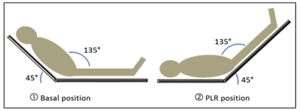
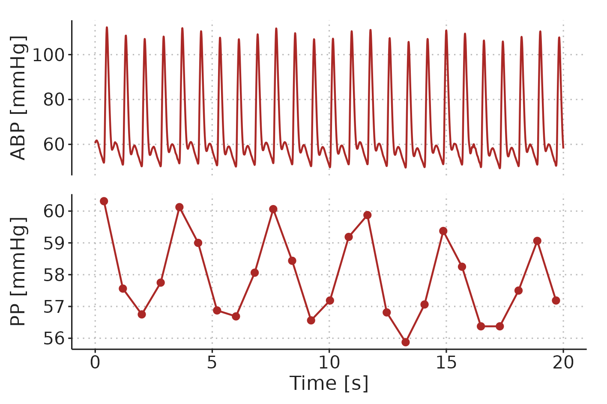
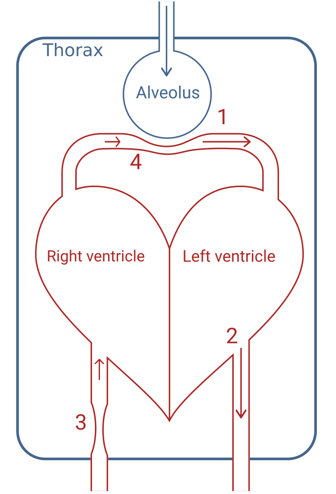
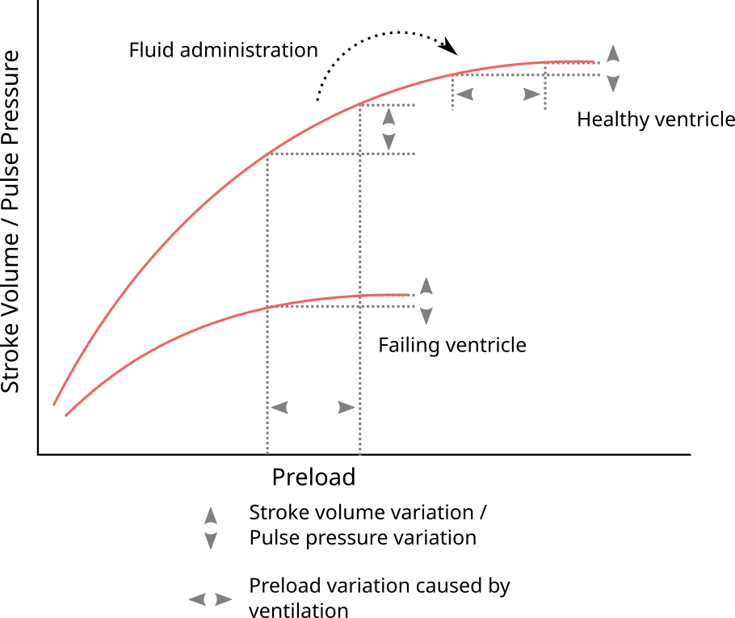

---
#########################################
# options for knitting a single chapter #
#########################################
output:
  bookdown::pdf_document2:
    template: templates/brief_template.tex
    citation_package: biblatex
  bookdown::html_document2: default
  bookdown::word_document2: default
documentclass: book
#bibliography: [bibliography/references.bib, bibliography/additional-references.bib]
---

## Fluid responsiveness prediction 

Fluid responsiveness prediction attempts to answer the question: will this patient benefit from a fluid bolus? More precisely, it attempts to answer whether fluid will increase the patient’s CO, which is a necessary---but not sufficient---condition for benefitting from a fluid bolus (see Figure \@ref(fig:background-monnet2018-aic-fluid2organ)). 

Clinical observations and measurements have long been used as indications that a patient might benefit from fluid administration. Examples are: tachycardia, hypotension, low central venous pressure (CVP) and high plasma lactate. These clinical findings are all common in hypovolemia, but they also have several other causes. Generally, these findings are poorly related to fluid responsiveness [@marikDoesCentralVenous2013; @monnetArterialPressureAllows2011; @debackerPulsePressureVariations2005].

Instead, several *dynamic* methods for predicting fluid responsiveness have been proposed. Here, *dynamic* refers to the concept of manipulating the heart's working position on the Frank-Starling curve, and evaluating the effect on SV (either directly or *via* a surrogate measure). 

## Passive leg raise

The passive leg raise manoeuvre attempts to evaluate the effect of a fluid bolus, without giving any fluid. By raising the patient's legs, unstressed volume is mobilised, increasing $P_{MSF}$ analogous to a fluid challenge (see Figure \@ref(fig:background-plr-test)). If the patient responds to this *autotransfusion*, they are also expected to respond to a subsequent fluid challenge [@monnetPassiveLegRaising2015]. Unfortunately, the passive leg raise is rather impractical during surgery.

```{r background-plr-test}
#| out.width="80%",
#| fig.cap="(ref:background-plr-test)",
#| fig.scap="Passive leg raise manoeuvre"

```

(ref:background-plr-test) Illustration of the passive leg raise (PLR) manoeuvre. From Wikimedia by Patricia.Pineda.Vidal ([CC BY](https://creativecommons.org/licenses/by/4.0/))

## The mini-fluid challenge

In the OPTIMISE trial, all fluid challenges were 250 ml, and each bolus was used to determine whether the next bolus should be given. This can be seen as a form of fluid responsiveness prediction: if the patient does not respond to the bolus, there is a low probability that a subsequent bolus will elicit a response; if the patient does respond, the probability is higher, and a subsequent bolus is given (and so on ...). If these fluid challenges are used frequently to test fluid responsiveness in a non-responsive patient, it can accumulate to a significant amount of ineffective fluid. A potential solution was proposed by Muller et al. in 2011: the mini-fluid challenge (MFC) [@Muller2011].

With a MFC, a low volume of fluid, 100 ml, is used to test fluid responsiveness. If the patient responds, 400 ml of fluid is subsequently given. Thus, if a patient is non-responsive to fluid, only 100 ml of ineffective fluid have been given.

The accuracy of the MFC in predicting fluid responsiveness was summarised in a systematic review from 2019 including seven studies [@messinaFunctionalHemodynamicTests2019]. The pooled area under the receiver operating characteristic curve (AUROC) was 0.91, 95% confidence interval (CI) [0.85; 0.97], indicating a highly accurate prediction. 

### Limitations to the mini-fluid challenge

In most studies investigating the predictive ability of the MFC, SV is measured trice: before the MFC, after the MFC and after the 400 ml bolus. The SV response to the MFC is used to predict the response to the entire 500 ml of fluid given, and the accuracy of this prediction is evaluated. Essentially one change (from 0 ml to 100 ml) is used to predict another change (from 0 ml to 500 ml). Change scores are notoriously difficult to analyse correctly, and most MFC studies do indeed encounter statistical problems. These problems are the topic of Paper 1. 

## Pulse pressure variation and heart-lung interaction {#heart-lung-interaction-physiology}

Ventilator induced pulse pressure variation (PPV) is the cyclic variation in pulse pressure (PP) caused by mechanical ventilation (see Figure \@ref(fig:background-ppv-example)). 

```{r background-ppv-example}
#| out.width="100%",
#| fig.cap="(ref:background-ppv-example)",
#| fig.scap="Example of ventilator induced PPV"

```

(ref:background-ppv-example) Example of ventilator-induced PPV in a patient ventilated with a $V_T$ of 8 ml kg^-1^ and a RR of 17 min^-1^. ABP, arterial blood pressure. PP, pulse pressure.

Mechanical ventilation affects circulation in multiple ways [@vistisenWhatAnaesthesiologistNeeds2019]. The four principal factors contributing to PPV are illustrated in Figure \@ref(fig:background-heart-lung-interactions). 1) During inspiration, alveolar pressure squeezes out blood from lung capillaries and veins, increasing left-ventricular preload. 2) Lung inflation raises thoracic pressure and aids the flow of blood from the thorax, reducing left-ventricular afterload. Both effects (1 and 2) tend to increase left-ventricular SV during inspiration. Conversely, (3) right-ventricular preload is decreased, since the increased thoracic pressure reduces venous return, and (4) right-ventricular afterload is increased by the alveolar pressure during inspiration. These effects (3 and 4) decrease right-ventricular SV during inspiration. A decrease in right-ventricular SV will decrease left-ventricular preload, but this effect is delayed through the pulmonary circulation. The decreased SV from the right ventricle affects the left ventricle a few seconds later---at the beginning of the expiration---making all four effects contribute to respiratory variation in left-ventricular SV. In most patients, the effect on the right-ventricular preload (3) is the main mediator of ventilator-induced stroke volume variation (SVV) [@michardChangesArterialPressure2005]. 

```{r background-heart-lung-interactions}
#| out.width="50%",
#| fig.cap="(ref:background-heart-lung-interactions)",
#| fig.scap="Heart-lung interaction physiology"

```

(ref:background-heart-lung-interactions) Illustration of the three principal effects. **1)** Squeeze of peri-alveolar vessels. **2)** Higher thoracic pressure facilitates blood flow out of the thorax. **3)** Decreased venous return to the right-ventricle due to higher thoracic pressure. **4)** Alveolar pressure increases right-ventricular afterload.

Pulse pressure is directly proportional to SV for a given arterial compliance [@chemlaTotalArterialCompliance1998]. The cardiac response to the small preload changes caused by the ventilator is therefore reflected in the arterial blood pressure waveform as PPV. Essentially, for a given variation in left-ventricular preload, PPV is proportional to the slope of the Frank-Starling curve at the current preload (see Figure \@ref(fig:background-starling-ppv)). Therefore, patients with a high PPV should get an increase in SV if they receive a fluid bolus.

```{r background-starling-ppv}
#| out.width="80%",
#| fig.cap="(ref:background-starling-ppv)",
#| fig.scap="PPV reflects the current slope on the Frank-Starling curve"

```

(ref:background-starling-ppv) Illustration of how PPV reflects the current slope on the Frank-Starling curve, and, therefore, is an indicator of fluid responsiveness.  

### Pulse pressure variation as a predictor of fluid responsiveness

In the late 1900s, a number of studies found that systolic pressure variation increased with lower circulating volume in both dogs [@perelSystolicBloodPressure1987; @pizovSystolicPressureVariation1988] and humans [@coriatComparisonSystolicBlood1994; @rookeEffectGradedHemorrhage1995]. In 1998, Tavernier et al. investigated the more clinically relevant question: did high systolic pressure variation predict fluid responsiveness?---it did [@tavernierSystolicPressureVariation1998]. The following couple years, results by Michard et al. indicated that PPV was an even better predictor [@michardClinicalUseRespiratory1999; @michardRelationRespiratoryChanges2000]. This finding was supported in a systematic review from 2009 that reported a pooled AUROC of 0.94, 95%CI [0.92; 0.96] [@marikDynamicChangesArterial2009].

### Limitations to pulse pressure variation

The use of blood pressure swings induced by heart-lung interactions by mechanical ventilation gained significant interest and scientific credibility in the 1990’s and early 2000’s [@teboulArterialPulsePressure2018]. In 2005, De Backer et al. published what would become a landmark study regarding limitations to the use of PPV: predicting fluid responsiveness with PPV was less accurate when the $V_T$ was < 8 ml kg^-1^ predicted body weight [@debackerPulsePressureVariations2005]. This study of 60 patients was soon adopted as firm evidence of the existence of a strict $V_T$ < 8 ml kg^-1^ limitation. The study, however, had some limitations itself. Patients that were ventilated with a low $V_T$ (< 8 ml kg^-1^) also had other unique and possibly confounding characteristics: all but one had acute respiratory distress syndrome (ARDS), while only one had ARDS in the higher $V_T$ group. Therefore, lung-mechanics, including compliance, were very different between the groups. Respiratory rates were likely also higher in the low $V_T$ group to maintain adequate ventilation. In later studies the effects of RR and respiratory system compliance was investigated. De Backer et al., 2019 reported that a heart-rate-to-respiratory-rate ratio (HR/RR) < 3.6 markedly reduced PPV [@Backer2009] (though this effect could also be caused by RR directly), and Monnet et. al. showed in 2012 that low respiratory system compliance (< 30 ml cmH~2~O^-1^) reduced PPV’s ability to predict fluid responsiveness [@monnetPassiveLegraisingEndexpiratory2012]. Today, all these aspects are considered individual limitations to PPV [@teboulArterialPulsePressure2018; @michardApplicabilityPulsePressure2015]. However, low $V_T$, high RR and low respiratory compliance often appear together (e.g. in ARDS), and one or more of these circumstances may confounded the others when identifying them as limitations.

Dissecting the effects of $V_T$ and RR on PPV is the topic of Paper 3, and Paper 2 presents an alternative method for calculating PPV, which may be less sensitive to low HR/RR.

The ventilation-related limitations to PPV presented above are not the only situations where PPV may be unreliable. Some additional limitations are presented here, but these will not be addressed further in this dissertation. The most common limitations to the use of PPV has been summarised with the **LIMITS** acronym [@michardApplicabilityPulsePressure2015]: **L** is for low HR/RR, which is one of the limitations addressed in this dissertation. **I** is for irregular heart beats, representing that arrhythmia and frequent extrasystoles causes PPV that is not just related to ventilatory preload variation, but also related to variable intervals between beats. Wyffels et al., 2021 present a promising method for extracting ventilatory PPV in patients with atrial fibrillation, but this method has not yet been clinically validated [@wyffelsNewAlgorithmQuantify2021]. **M** is for mechanical ventilation with $V_T$ < 8 ml kg^-1^: the other limitation addressed in this dissertation. **I** is for increased abdominal pressure, which primarily refers to laparoscopic surgery. High abdominal pressure decreases thoracic compliance, potentially increasing PPV for a given $V_T$ [@magderClinicalUsefulnessRespiratory2004]. **T** is for open thorax, where variation in intrathoracic pressure is eliminated. And **S** is for spontaneous breathing, which also refers to minimally sedated patients whose ventilation is supported by a ventilator. Spontaneous breathing reduces or inverts the ventilatory variation in thoracic pressure, making any resulting PPV difficult to interpret.

## Other dynamic preload indicators

During the past two decades, other *dynamic* methods for predicting fluid responsiveness have emerged. These include the end-expiratory occlusion test (EEOT) and the tidal volume ($V_T$) challenge [@monnetPredictionFluidResponsiveness2022]. 

Of these, the EEOT is the best validated. The method utilises that an transient end-expiratory occlusion manoeuvre (15 seconds) increases the pressure gradient for venous return (by lowering $P_{RA}$), causing a right-shift on the Frank-Starling curve [@monnetPredictingVolumeResponsiveness2009]. If the flow response to the EEOT is high, patients are likely to be fluid responders. A systematic review of this method reported an AUROC of 0.96, 95%CI [0.92; 1.00], for predicting fluid responsiveness [@messinaFunctionalHemodynamicTests2019]. The drawback of the EEOT is that it requires active intervention, and patients must be mechanically ventilated with no or little breathing effort. It is best validated with continuous flow monitoring as the predictor, though an increase in PP with end-expiratory occlusion seems to predict fluid responsiveness as well [@monnetPredictionFluidResponsiveness2022]. Also, it may require that the baseline $V_T$ is >8 ml kg^-1^ [@myatraChangesPulsePressure2017]. Most EEOT studies have been conducted in the ICU, and end-expiratory occlusion may not be possible on all anaesthesia machines, potentially limiting the applicability for intraoperative use [@biaisEndExpiratoryOcclusionTest2017].

The $V_T$ challenge consists of changing the $V_T$ from 6 ml kg^-1^ to 8 ml kg^-1^, causing an increase in PPV [@myatraChangesPulsePressure2017]. The manoeuvre increases PPV and the increase should be higher in fluid responders. In a recent systematic review that only included a few $V_T$ challenge studies, the $V_T$ challenge predicted fluid responsiveness with an AUROC of 0.92 (no CI reported) [@alvaradosanchezPredictorsFluidResponsiveness2021]. The $V_T$ challenge requires an active intervention, and has the same limitations as PPV itself. When the $V_T$ challenge is done, and $V_T$ is 8 ml kg^-1^, the $V_T$ limitation is of course removed. The PPV at a $V_T$ of 8 ml kg^-1^ is in itself predictive of fluid responsiveness, though the $V_T$ challenge might offer some additional predictive accuracy [@myatraChangesPulsePressure2017]. However, the performance of the $V_T$ challenges has rarely been compared to the performance of PPV at $V_T$=8 ml kg^-1^, and Xu et al., 2022 showed no difference in performance between the two predictors [@xuEfficacyUsingTidal2022]. 

## Aims

The aim of this PhD was to tackle limitations to two popular methods for fluid responsiveness prediction in the intra-operative setting: PPV and MFC. For PPV, I address the limitations that apply to deeply sedated patients in sinus rhythm undergoing open, non-thoracic surgery.

The aim of Paper 1 was to explain a statistical problem with the design used in most studies of the MFC’s ability to predict fluid responsiveness, and to propose a better design.

The aim of Paper 2 was to introduce generalized additive models (GAMs) as a tool for analysing medical time series and waveforms, to propose how PPV derived from a GAM could help overcome the low HR/RR limitation, and to propose more advanced and experimental use cases of GAMs. 

The aim of Paper 3 was to analyse the effects of $V_T$ and RR on PPV, and to investigate how these ventilator settings impacted PPV’s ability to predict fluid responsiveness.

