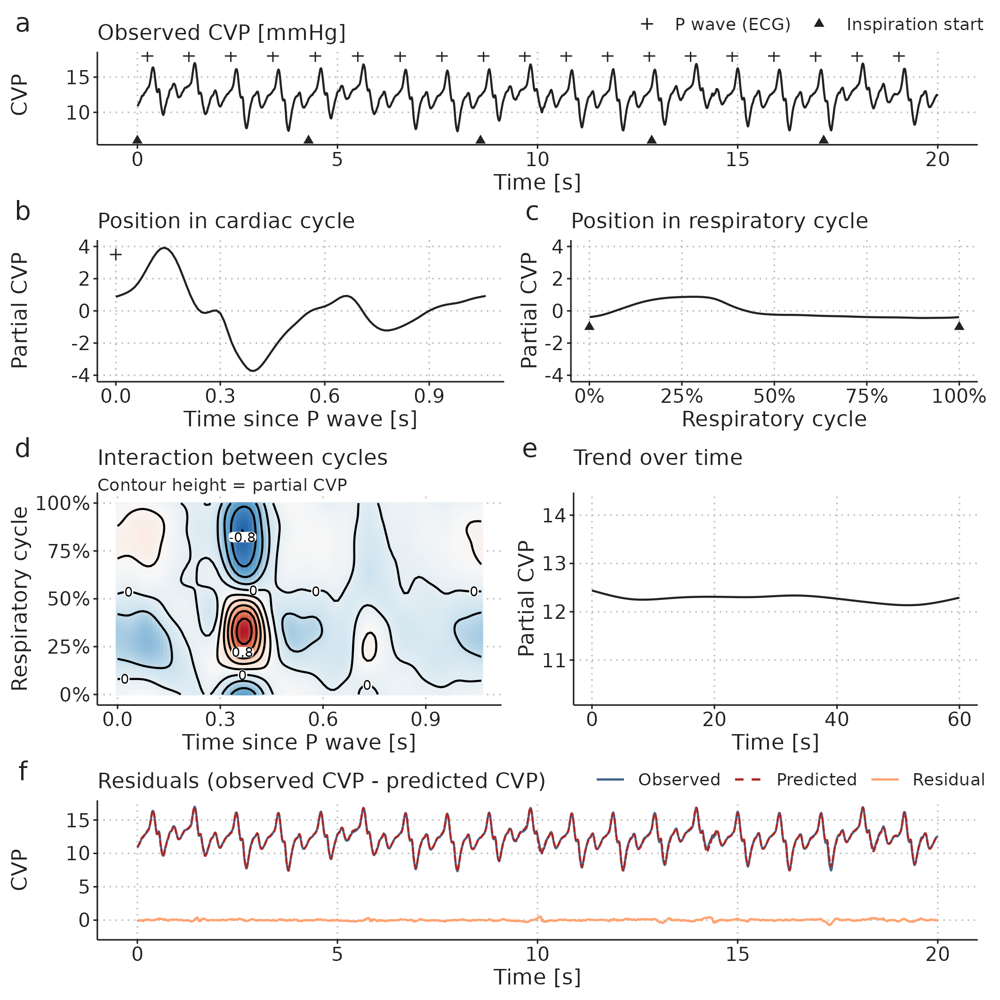

---
#########################################
# options for knitting a single chapter #
#########################################
output:
  bookdown::pdf_document2:
    template: templates/brief_template.tex
    citation_package: biblatex
  bookdown::html_document2: default
  bookdown::word_document2: default
documentclass: book
#bibliography: [bibliography/references.bib, bibliography/additional-references.bib]
---

```{block type='savequote', quote_author='(ref:goodman-quote)', echo=TRUE, include=knitr::is_latex_output()}
"Few terms are used in popular and scientific
discourse more promiscuously than 'model'. A model is something to be admired or emulated, a pattern, a case in point, a type, a prototype, a specimen, a mock-up, a mathematical description—almost anything from a naked blonde to a quadratic equation."
```

(ref:goodman-quote) --- **Nelson Goodman**, 1968 (Languages of Art, p. 171)


# Methods

This chapter introduces and discusses the methods used in the three Papers. In all three Papers, *models* have a central role; both as communicative tools and as specific statistical models (Papers 2 and 3). Therefore, the first section is a general introduction to the scientific use of the term *model*.

## An introduction to *models*

In science, *model* is often used as a synonym for both a statistical analysis, a simple representation of a complex system or a sophisticated computer simulation. However, the word's exact meaning is often not specified, and has to be assumed from context. I will use this section to present the different meanings of the term *model*, focusing on those that are relevant for the present dissertation.

### A model can be a mental and communicative tool

Consider the four effects of ventilation causing pulse pressure variation, illustrated in Figure \@ref(fig:background-heart-lung-interactions). To recap, in the right ventricle, inspiration lowers SV by limiting venous return and increasing afterload; in the left ventricle, inspiration increases pulmonary venous return by squeezing blood from the lungs and reduces afterload by increasing thoracic pressure relative to the remaining arterial pressure. Together these effects cause PPV. Of course, real physiology is more complex, but this simple *model* may aid a scientist in designing a study investigating the effect of e.g. PEEP on PPV, and it can give colleagues a common reference when discussing the interpretation of a high PPV in a patient with right ventricular failure. Without a common model, miscommunication will likely happen as each colleague has their own private mental model of the situation, and may assume that their peer's mental model is identical. 

This conceptual model of PPV is, however, not detailed enough, to enable quantitative predictions of what will happen to PPV, if we change ventilator settings; it is only a qualitative description of the relationship between ventilation and SV. To make quantitative predictions from a model, we need to mathematically define the relationship between the variables in the model. 

### Mathematical models

A mathematical model is a set of equations that, unambiguously, describes how a system behaves, often over time. The 2-compartment model of venous return (see Figure \@ref(fig:background-venous-return-simple)) can be presented as a mathematical model. We can present equations defining how the compartments behave and how they are connected. The pressure in the compartments (right atrial and venous, but exemplified here with the right atrial compartment) is  
$$ 
P_{RA} = \frac{V_{RA}}{C_{RA}},
$$
where $P$ is pressure, $V$ is volume and $C$ is compliance. Venous return ($Q_V$) is
$$
Q_V = \frac{P_V - P_{RA}}{R_V},
$$
where $R_V$ is resistance to venous return. The change in volume over time in each compartment is:
$$
\dot{V}_V = CO - Q_{V}, \quad \dot{V}_{RA} = Q_{V} - CO.
$$
To solve this set of differential equations, we define a constant CO (or a Frank-Starling-like cardiac function), a fixed compliance for each vascular compartment, a fixed $R_V$ and set the starting volumes for each vascular compartment ($V_V$ and $V_{RA}$). We can now simulate how these volumes will evolve over time, and what their steady-state values will be. 

### Statistical models

A statistical model is a specific type of mathematical model that uses random variation to explain the difference between the values expected from the model, and the values that are actually measured. In medical science, statistical models are usually extremely simplified representations of the actual (or assumed) causal relationship between variables. 

For example, we may believe that $V_T$ affects PPV through a number of intermediate steps. But often, we are not interested in the intermediate effects—they may not even be identifiable from the data we have available. Instead we may assume that if we vary $V_T$ in a single individual, there is a linear relationship between $V_T$ and PPV:
$$
PPV = \alpha + \beta V_T.
$$
If we measure PPV repeatedly, and only change $V_T$ between measurements, we expect that PPV will vary according to the linear model above. Additionally, we also anticipate some variation in PPV that is not explained by the change in $V_T$. This additional variation can be due to a physiological change over time, unrelated to the $V_T$ change, or due to imprecise measurements. Unexplained variation is traditionally represented by the greek letter $\epsilon$, creating the statistical linear model:
$$
PPV = \alpha + \beta V_T + \epsilon.
$$
The statistical analysis of such a model quantifies how the independent variables (here $V_T$) and random variation ($\epsilon$) together explain the observed variation in the dependent variable (here PPV), and, importantly, how certain we are of each component's contribution.

## Paper 1 -- The mini-fluid challenge

Paper 1 is a critique of the method used in most existing studies of the MFC as a predictor of fluid responsiveness. In this section, I will describe this common design and explain why it is problematic. 

Most MFC studies [@Muller2011; @smorenbergMinifluidChallenge1502018; @biaisMinifluidChallenge1002017; @wu10secondFluidChallenge2014; @aliAbilityMinifluidChallenge2019; @mukhtarValidityMinifluidChallenge2019; @leeMinifluidChallengeTest2020; @fotDynamicTestsPredict2020; @messinaMiniFluidChAllenge2021] use a design where SV, or a related variable, is measured thrice. First, a baseline measurement before any fluid is given; then, after the MFC (e.g. 100 ml) is given; and, lastly, after the remaining fluid (e.g. 400 ml) is given. The response to the MFC, here referred to as $\Delta SV_{100}$, is then calculated as the relative change in SV from baseline to after the MFC. The outcome to predict, is the change from baseline to after the entire volume is given, here referred to as $\Delta SV_{500}$ (see Figure \@ref(fig:methods-mfc-common-design)).

```{r methods-mfc-common-design}
#| out.width="100%",
#| fig.cap="(ref:methods-mfc-common-design)",
#| fig.scap="The common mini-fluid challenge study design"

```

(ref:methods-mfc-common-design) The design used in most studies of the MFC.

This design has two major problems. First, the response to the MFC is included in the outcome, that the MFC is supposed to predict. This creates a self-fulfilling prophecy: if the MFC response is high enough, the patient can have no response to the remaining fluid, and the conclusion will still be, that the MFC correctly predicted the full fluid response. 

The second problem is more subtle. Measurements of SV are influenced by some random variation. This variation is caused by both measurement error and short-term physiological variation in SV. Both are essentially *noise* to the clinician, who wants to evaluate the response to a fluid challenge. The clinician is interested in the underlying, but unknowable average SV, not the short-term variation around this value. I will call this the "true" SV. If a measurement is, by chance, higher than the "true" SV, the next measurement will most likely show a decrease. Likewise, if a measurement is randomly low, the next will likely be higher than the current. This phenomenon is called *regression towards the mean* (see Figure \@ref(fig:method-reg-to-the-mean)).

```{r method-reg-to-the-mean}
#| out.width="100%",
#| fig.cap="(ref:method-reg-to-the-mean)",
#| fig.scap="Regression towards the mean"
knitr::include_graphics("figures/method-reg-to-the-mean.png")
```

(ref:method-reg-to-the-mean) An illustration of *regression towards the mean*. An extreme SV measurement is likely followed by a measurement closer to the "true" (mean) SV.

In the common MFC study design, $SV_{baseline}$ is included in the calculation of both the predictor ($\Delta SV_{100}$) and the outcome ($\Delta SV_{500}$). Therefore, the random measurement error in $SV_{baseline}$ is included in both the predictor and the outcome, making them spuriously correlated [@archieMathematicCouplingData1981; @strattonRegressionCalculatedVariables1987]. In Figure \@ref(fig:method-mfc-null-sim), this spurious correlation is illustrated with a simple computer simulation. It shows a simulated a MFC study, where all subjects have no response to fluid; only random variation in measured SV. A correct analysis should show that the MFC has no predictive ability---since there is nothing to predict---but it is clear that the change over the MFC ($\Delta SV_{100}$) is correlated to the change over the full fluid administration ($\Delta SV_{500}$) (see Figure \@ref(fig:method-mfc-null-sim)b).

```{r method-mfc-null-sim}
#| out.width="100%",
#| fig.cap="(ref:method-mfc-null-sim)",
#| fig.scap="MFC simulation without response"
knitr::include_graphics("figures/method-mfc-null-sim.png")
```

(ref:method-mfc-null-sim) A simulated MFC study with 2000 subjects. Each subject has a constant "true" SV, and only random measurement variation around this value. **a**) A sample of data from 15 of the simulated subjects. **b**) Relationship between the MFC response and full fluid response. **c**) Relationship between MFC response and the response to the remaining fluid.

The first problem, that the predictor is included in the outcome, can be fixed by predicting the response to only the remaining 400 ml ($\Delta SV_{400}$). This, however, simply reverses the second problem, as the predictor and outcome now share the measurement error at $SV_{100}$, creating an inverse spurious correlation (see Figure \@ref(fig:method-mfc-null-sim)c).

To illustrate the magnitude of the bias, we reanalysed data from the MFC study by Muller et al. [@Muller2011]. Instead of showing the MFC’s ability to predict the full fluid response, we analysed the MFC’s ability to predict the response to the remaining 400 ml fluid. We did this by extracting data from Fig. 3A in Muller et al., 2011 [@Muller2011], and used the plotted $\Delta SV_{100}$ and $\Delta SV_{500}$ to calculate $\Delta SV_{400}$.[^vti] As noted in the paragraph above, this approach is also biased, but now in the opposite direction.

[^vti]: In Muller’s study, the fluid response was evaluated with left-ventricular outflow tract velocity time integral (LVOT VTI, a Doppler ultrasonic measure correlated with SV). For simplicity, we simply refer to this as SV.

## Paper 2 -- Generalized additive models

Paper 2 introduces generalized additive models (GAMs) as a tool for analysing medical time series and waveforms. The paper describes how GAMs can be used for robust estimation of PPV (a method used in Paper 3), and it presents a novel method for decomposing medical waveforms into simpler, repeating components.

### An introduction to generalized additive models

A GAM is an extension of the generalized linear model [@hastieGeneralizedAdditiveModels1986]. For the purposes described here, we can, however, disregard the *generalized* part, and simply consider GAMs as multiple regression models that can fit smooth functions instead of only straight lines. These smooth functions are called regression splines (see Figure \@ref(fig:method-wood-spline)). Figure \@ref(fig:method-lm-vs-gam) illustrates how a linear model and a GAM fit the same simulated data.

```{r method-wood-spline}
#| out.width="50%",
#| fig.cap="(ref:method-wood-spline)",
#| fig.scap="A wooden spline"
knitr::include_graphics("figures/method-wood-spline.png")
```

(ref:method-wood-spline) A regression spline is named after the wooden splines traditionally used by technical drawers for tracing smooth curves. (by Pearson Scott Foresman, public domain).

```{r method-lm-vs-gam}
#| out.width="100%",
#| fig.cap="(ref:method-lm-vs-gam)",
#| fig.scap="Linear model vs GAM"
knitr::include_graphics("figures/method-lm-vs-gam.png")
```

(ref:method-lm-vs-gam) A linear model and a generalized additive model (GAM) fitting the same simulated data.

In hemodynamic time series and waveforms, we often have patterns that repeat with each respiratory cycle or heart beat. When we fit such a repeating pattern with GAM, we can constrain the spline to start and end at the same value, slope and curvature (0th, 1st and 2nd derivative), to create a smoothly repeating curve (a cyclic spline). The function that generates the data in Figure \@ref(fig:method-lm-vs-gam) is $Y = sin(X)$, so we know that it repeats itself at $X = 2\pi = 6.28$. Figure \@ref(fig:method-gam-cyclic) illustrates the fit of the GAM with this additional, cyclic constraint.

```{r method-gam-cyclic}
#| out.width="100%",
#| fig.cap="(ref:method-gam-cyclic)",
#| fig.scap="A cyclic spline"
knitr::include_graphics("figures/method-gam-cyclic.png")
```

(ref:method-gam-cyclic) Illustration comparing a cyclic spline fit to the data-generating function ($Y = sin(X)$ with added Gaussian noise).

The high flexibility of GAMs could also make them prone to overfitting data. This is countered by penalising the splines by their wiggliness (wiggliness is the inverse of smoothness). 

A classic (unpenalised) least squares fit is found by minimising the loss function:
$$
\sum_{i=1}^n (Y_i-\hat{Y}_i)^2,
$$
where $Y_i$ are the observed values and $\hat{Y}_i$ are the values predicted by the model. For fitting penalised splines, a wiggliness penalty is added to the loss function:
$$
\sum_{i=1}^n (Y_i-\hat{Y}_i)^2 + \lambda\int f''(X)^2 dX.
$$
$f''(X)$ is the curvature of the spline (for a straight line, the curvature is 0). This is squared to keep it positive and then integrated over the range of the independent variable, $X$. The smoothing parameter, $\lambda$, is used to control the tradeoff between fitting data with minimal error and preferring a smooth spline less "prone" to overfitting [@woodGeneralizedAdditiveModels2017]. It is possible, and often recommended, to automatically choose the smoothing parameter that optimise out-of-sample prediction (e.g. through cross-validation) [@woodFastStableRestricted2011] (see Figure \@ref(fig:method-gam-wiggliness)).

```{r method-gam-wiggliness}
#| out.width="100%",
#| fig.cap="(ref:method-gam-wiggliness)",
#| fig.scap="Penalised regression spline"
knitr::include_graphics("figures/method-gam-wiggliness.png")
```

(ref:method-gam-wiggliness) In a penalised spline, the smoothing parameter, $\lambda$, determines the tradeoff between fitting the data and creating a smooth line. $lambda$ can be automatically chosen to minimise the risk of overfitting.

### Estimating PPV using GAMs {#gam-ppv}

Using GAMs for estimating PPV was first proposed by Wyffels et al. [@wyffelsNewAlgorithmQuantify2021]. They demonstrated how GAMs could be used to isolate the respiratory variation in PP in patients with atrial fibrillation, from the PPV caused by irregular beat-to-beat intervals. In Paper 2, we demonstrate how to use a simpler version of Wyffel’s model to estimate PPV from PP time series recorded on patients in sinus rhythm.

In sinus rhythm, the major source of PPV is respiratory variation in PP (as described in Section \@ref(heart-lung-interaction-physiology)). We expect that there is some smooth relationship between *when in the respiratory cycle a heart beat occurs* and *the PP it produces*. We also expect that the PP produced by a beat in the end of a cycle is very similar to the PP produced by a beat in the beginning of a cycle; i.e., that the effect of the *position in the respiratory cycle* is cyclic. This cyclic respiratory variation in PP can be represented with the following GAM:
$$
E(PP) = \alpha + f(pos_{\text{respiratory cycle}}),
$$
where $E(PP)$ is the expected PP, $\alpha$ is the mean PP and $f(pos_{\text{respiratory cycle}})$ is the variation in PP around the mean, represented as a cyclic spline that goes from 0 (start of respiratory cycle) to 1 (end of respiratory cycle) and connects smoothly back to 0 (see Figure \@ref(fig:method-gam-PP)b).

In addition to the respiratory variation in PP, we also want the model to allow that PP can change slowly over time:
$$
E(PP) = \alpha + f(pos_{\text{respiratory cycle}}) + f(time).
$$
Now, $E(PP)$ is the sum of the repeating effect respiration and a smooth trend in PP over time ($f(time)$) (see Figure \@ref(fig:method-gam-PP)). 

```{r method-gam-PP}
#| out.width="100%",
#| fig.cap="(ref:method-gam-PP)",
#| fig.scap="Fitting a GAM pulse pressure"

```

(ref:method-gam-PP) Illustration of how a pulse pressure (PP) time series (**a**) can be modelled as a smooth repeating effect of ventilation (**b**) and a slow trend over time (**c**). Panel **d** shows the models prediction (fit): the sum of the mean PP, the effect of ventilation (**b**) and the trend over time (**c**). 

From the fitted GAM, we can calculate PPV as the amplitude of the respiratory effect (Figure Figure \@ref(fig:method-gam-PP)b) divided by the mean PP ($\alpha$):
$$
PPV = 100\% \cdot \frac{ max(f(pos_{\text{respiratory cycle}})) - min(f(pos_{\text{respiratory cycle}})) }{\alpha} 
$$ 

### Decomposing waveforms

In the PP model above, we reduced the arterial blood pressure waveform to a time series of PP measurements before fitting the GAM. It is also possible to decompose a raw waveform. In addition to the effect of ventilation, we now also have a smooth effect that repeats with each heartbeat. Furthermore, these two effects may interact. In Paper 2, we exemplify this by decomposing a CVP waveform. The GAM has the following form:
\begin{align*}
E(CVP) = &\alpha + f(pos_{\text{cardiac cycle}}) + f(pos_{\text{respiratory cycle}}) \\
&+ f(pos_{\text{cardiac cycle}}, pos_{\text{respiratory cycle}}) + f(time).
\end{align*}
Here, $f(pos_{\text{cardiac cycle}})$ is similar to $f(pos_{\text{respiratory cycle}})$, but repeats with every cardiac cycle (starting at the P-wave in the ECG). $f(pos_{\text{cardiac cycle}}, pos_{\text{respiratory cycle}})$ is a 2-dimensional smooth plane representing the effect of the interaction between the respiratory cycle and the cardiac cycle on CVP (see Figure \@ref(fig:method-gam-CVP)).

```{r method-gam-CVP}
#| out.width="100%",
#| fig.cap="(ref:method-gam-CVP)",
#| fig.scap="Fitting a GAM to CVP"

```

(ref:method-gam-CVP) A central venous pressure (CVP) waveform (**a**) can be decomposed using a GAM into: **b**, a repeating effect for each heartbeat; **c**, a cyclic effect of ventilation; **d**, an interaction effect between the respiratory- and cardiac cycles; and, **e**, a slow trend over time (added to the mean CVP). Panel **f** shows the models prediction and the prediction error (residual): The prediction is the sum of the effects visualised in **b** to **e**. 

## Paper 3 -- Effects of Ventilator Settings on PPV

Paper 3 investigates the effects of $V_T$ and RR on PPV, and how these ventilator setting affect PPV’s ability to predict the SV response to a fluid bolus. We expected that PPV at $V_T$=10 ml kg^-1^ and RR=10 min^-1^ would predict fluid responsiveness with high accuracy, but that the accuracy would fall with lower $V_T$ and higher RR. 

The study was approved by the regional ethics committee (January 2020, case 1-10-72-245-19) and registered on ClinicalTrials.gov (March 2020, NCT04298931). It was conducted at Aarhus University Hospital from May 2020 to June 2021. Patients gave written informed consent to participate.

Paper 3 presents a number of statistical methods including Bland-Altman analysis for method comparison, bootstrapped confidence intervals, mixed-effects models and Bayesian statistics. In this dissertation, I will only elaborate on Bayesian statistics and explain the Bayesian mixed-effects model presented in the paper.

### Protocol

The experiment protocol was initiated after anaesthesia induction, in relation to a planned 250 ml fluid administration, where the patient was considered hemodynamically stable by the treating anesthesiologist. First, the patient was ventilated with ten different ventilator settings for 30 s each. Each setting was a unique combination of $V_T$ between 4 and 10 ml kg^-1^ (predicted body weight [@theacuterespiratorydistresssyndromenetworkVentilationLowerTidal2000]) and RR between 10 and 31 min^-1^ (see Figure \@ref(fig:methods-vent-settings)). Then, a two-minute period was used to establish a baseline SV, after which a 250 fluid bolus was administered. If SV after the fluid administration was more than 10% higher than the baseline SV, the patient classified as a fluid responder.

```{r methods-vent-settings}
#| out.width="80%",
#| fig.cap="(ref:methods-vent-settings)",
#| fig.scap="Ventilator settings in Paper 3"

```

(ref:methods-vent-settings) Example of the ventilation protocol. Dots represent combinations of $V_T$ and RR. Settings were applied in numerical order. The order of RR=17, 24 and 31 min^-1^ were drawn at random for each subject. Curved lines represent settings that should result in equal alveolar ventilation, assuming a dead space volume of 1 ml kg^-1^. 

### PPV calculation

PPV was calculated using two different methods: 

$PPV_{Classic}$ was calculated as described in the study introducing low HR/RR as a limitation to the reliability of PPV [@Backer2009; @michardClinicalUseRespiratory1999]:
$$
PPV_{Classic} = \frac{PP_{max} - PP_{min}}{(PP_{max} + PP_{min})/2)},
$$
averaged over three consecutive ventilation cycles.

$PPV_{GAM}$ was calculated as described in Paper 2 (see Section \@ref(gam-ppv)). 

### Stroke volume measurement using uncalibrated pulse contour analysis {#methods-co}

In Paper 3, we measured SV using the commercial FloTrac algorithm (fourth generation) built into the cardiac monitor (Hemosphere or EV1000, Edwards Lifesciences, Irvine, California) routinely used during major abominal surgery at Aarhus University Hospital. The FloTrac estimates beat-to-beat SV with a proprietary algorithm that analyses the arterial blood pressure waveform. 

Since change in SV is used to determine a patient's response to a fluid bolus, it is important that the FloTrac estimates SV correctly, and, especially, that changes in SV are measured correctly. 

There are several methods for estimating SV or CO. The conversion between these is $CO = SV \cdot HR$, and in the following, I will simply refer to all methods as estimating CO. The gold standard for CO measurement is debated, but is generally considered to be the *direct Fick principle* or *thermodilution* (CO~TD~) via a pulmonary artery catheter [@kovacsOfficialEuropeanRespiratory2017; @mckenzieReliabilityThermodilutionDerived2018]. Thermodilution is more common in clinical practice, and is usually the reference, when new methods for measuring CO are evaluated [@joostenAccuracyPrecisionNoninvasive2017; @montenijMethodologyMethodComparison2016].  

The first three generations of the FloTrac algorithm were evaluated in a systematic review of 65 studies [@slagtSystematicReviewUncalibrated2014]. The overall *percentage error* was approx. 50%; a slightly simplified interpretation of this statistic is, that if a patient has a *true* CO of 5 L min^-1^, the difference between CO~FloTrac~  and CO~TD~ can be up to 2.5 L min^-1^. The fourth-generation FloTrac (used in Paper 3) aimed to improve performance, but of 6 studies comparing the fourth-generation FloTrac against CO~TD~, one showed a percentage error of 35% [@geisenAccuracyPrecisionTrending2018] while the others had a percentage error of >50% [@heijneFourDifferentMethods2020; @murataAgreementContinuousCardiac2022; @eisenriedAccuracyTrendingAbility2019; @suehiroImprovedPerformanceFourthGeneration2015; @maedaAccuracyTrendingAbility2019].

Even if CO~FloTrac~ does not always agree with CO~TD~, they could agree on the changes in CO, if the difference between the devices is relatively constant within each patient. This agreement on CO changes (often denoted *trending ability*) is evaluated in most recent studies. These results are, unfortunately, not encouraging either; a 20% increase in CO~TD~ may be accompanied by a fall in CO~FloTrac~ or *vice versa* [@geisenAccuracyPrecisionTrending2018; @eisenriedAccuracyTrendingAbility2019; @heijneFourDifferentMethods2020; @murataAgreementContinuousCardiac2022; @maedaAccuracyTrendingAbility2019].

The performance of FloTrac may, however, be underestimated, since it is evaluated on its agreement with CO~TD~, which is likely imprecise itself [@narangThermodilutionCardiacIndex2021; @narangComparisonAccuracyEstimation2022]. 

### Bayesian statistics

The use of Bayesian statistics in Paper 3 is mainly due to the flexibility of Bayesian models, rather than a choice based on the Bayesian *vs* frequentist philosophy of statistics, or a wish to incorporate *prior* knowledge. Still, it is relevant to give a short, general introduction to Bayesian statistics, as many scientists have sparse familiarity with the topic.

Bayesian statistical models can be understood from a generative perspective: we define a model that we believe could generate data similar to what we have observed, if the model parameters are set appropriately. Finding the values for the model parameters, that makes the generated data most similar to the observed data, is  called *fitting* the model. We define a model based on our *domain knowledge* about the relation between the predictor- and outcome variables, we specify our *prior* knowledge about the model parameters, and we provide some data we have observed. From these three components, the *model*, the *data* and the *priors*, we can answer the question: *If the data was generated by our proposed model, which sets of parameter values are compatible with the data we have observed?* [@mcelreathStatisticalRethinkingBayesian2020].

Bayesian updating provides the recipe for *fitting* the model, i.e. the act of turning *data* and *prior* knowledge about model parameters into *posterior* knowledge about model parameters (*prior* is before seeing the data, *posterior* is after seeing the data). This is formalised in Bayes theorem:
$$
P(parameters|data) = \frac{P(data|parameters) P(parameters)}{P(data)},
$$
where, 

- $parameters$ is a specific set of parameter values,
- $P(parameters)$ is the *prior*: our belief about how plausible the set of parameter values is without seeing the *data*,
- $P(data|parameters)$ is the *likelihood* distribution: how plausible the data we have observed is given the specific set of parameter values, 
- $P(data)$ is the average probability of the data: essentially how likely the data is on average for the entire prior parameter distribution (this is a bit abstract, but it essentially ensures that the posterior distribution will sum to 1).
- $P(parameters|data)$ is the *posterior* distribution of the model parameters: the plausibility of the parameter values after seeing the data. 

#### Bayesian updating of a simple model

\noindent To gain some intuition about how Bayesian updating works, we will go through fitting a very simple model. We sample subjects from a population and measure their heights. The aim is to estimate the mean and standard deviation (SD) of heights in the population from the heights in the sample. 

First, we define a generative model, i.e., a model that---with the right parameter values---will generate data that looks like the data we have collected. In this example, the model is simple: we assume that each subjects is drawn from a normal (Gaussian) distribution with a mean, $\mu$, and SD, $\sigma$:
$$
Height_i \sim Normal(\mu, \sigma),
$$
where $Height_i$ is the height of subject $i$. To complete the model, we add prior distributions for the two parameters, $\mu$ and $\sigma$:
\begin{align*}
\mu &\sim Normal(170, 20) \\
\sigma &\sim Uniform(1, 30).
\end{align*}
The interpretation of this prior distribution is, that before we see any data, we are quite certain that the mean height in the population ($\mu$) is somewhere between 130 and 210 cm ($170 cm \pm 2 \cdot 20 cm$), and that the SD ($\sigma$) is between 1 and 30 cm, with all values equally probable and values outside this range entirely impossible. These priors are only weakly informative and could be improved without much controversy, but here, their purpose is to illustrate how prior beliefs can be updated through observation of data.

Now, we systematically update our knowledge about the model parameters through observation of more and more data (heights). The top panel-pair in Figure \@ref(fig:method-bayes-update) displays our prior belief about the model parameters. When we start sampling heights from the population (black ticks in Figure \@ref(fig:method-bayes-update)), we update our beliefs about the parameter values, and the range of compatible parameter values become narrower. In this example, data is simulated, and we know that the *true* mean height ($\mu$) is 165 cm and the *true* SD ($\sigma$) is 10 cm. 

```{r method-bayes-update}
#| out.width="100%",
#| fig.cap="(ref:method-bayes-update)",
#| fig.scap="Bayesian updating"

```

(ref:method-bayes-update) Illustration of how prior beliefs can be updated through observation of data. See main text for an explanation of the simulation. Orange lines are *true* parameter values. Shaded areas are 95% compatibility intervals. Black ticks are observations.

In Figure \@ref(fig:method-bayes-update), the distributions of $\mu$ and $\sigma$ are visualised separately. They do, however, constitute a single, multidimensional, distribution, and in some models, parameter values can be highly correlated. Figure \@ref(fig:method-bayes-update-2d) visualise the two-dimensional distribution of the model parameters.

```{r method-bayes-update-2d}
#| out.width="100%",
#| fig.cap="(ref:method-bayes-update-2d)",
#| fig.scap="Bayesian updating with two-dimentional visualisation of distributions"

```

(ref:method-bayes-update-2d) The prior and posterior distributions are multidimensional distributions with a dimension for each parameter in the model. Color density represent probability density.

The shaded areas in Figure \@ref(fig:method-bayes-update) contain 95% of the probability mass for the parameter values. These are traditionally called 95% credible intervals, but I will use the alternative term *compatibility interval* (CI), as they can be interpreted as containing the parameter values that are compatible with the data we observe---this is also a reasonable interpretation of frequentist *confidence intervals* [@gelmanAreConfidenceIntervals2019]. 

### The mixed-effects model in Paper 3

A main aim in Paper 3 was to understand how $V_T$ and RR affect PPV. The experiment had a hierarchical structure, where PPV was measured repeatedly in each subject, with ten different RR and $V_T$ settings; we also calculated PPV with two different methods (PPV~Classic~ and PPV~GAM~) and wanted to know if $V_T$ and RR impact PPV differently depending on the method. We used a Bayesian generalized mixed-effects model to find the effects of $V_T$, RR and PPV-method on PPV. Below, I will walk through this model.

First, we specified a *likelihood function*. This specifies how likely different PPV values are given a mean, $\mu$, and a variance parameter, $\sigma$:
$$
PPV_{strm} \sim StudentT(\mu_{strm},\sigma_{trm}, \text{df} = 4),
$$
where $PPV_{strm}$ is PPV for subject $s$, $V_T$ $t$, RR $r$, PPV-method $m$. We used a Student’s T distribution with 4 degrees of freedom rather than a normal distribution, because it puts higher likelihood on extreme observations, and, therefore, is more robust to outliers.

We specified a linear model for $\mu$, which, in this model, represents the expected PPV:
$$
log(\mu_{strm}) = 
\beta0_m + 
\beta1_{tm} +
\beta2_{rm} +
\alpha_s.
$$
Specifically, the linear model is for $log(\mu)$. Therefore, the exponential of the parameters correspond to relative effects on PPV. $exp(\beta1_{tm})$ and $exp(\beta2_{rm})$ are the effects of each $V_T$- and RR setting for each PPV method relative to the expected PPV at $V_T$=10 ml kg^-1^ and RR=10 min^-1^. $exp(\beta0_m)$ is the expected PPV at $V_T$=10 ml kg^-1^ and RR=10 min^-1^ for each method. $\alpha_s$ is a random effect of each subject. It captures the between-individual variation in PPV.

The random effect, $\alpha$, was estimated for each subject. We assumed that $\alpha$ for each subject is draw from a shared normal distribution with SD $\sigma_{\alpha}$:
$$
\alpha_s \sim Normal(0, \sigma_{\alpha})
$$
This greatly reduces the degrees of freedom associated with estimating a parameter value for each subject. It also reduces the risk of overfitting, as the estimate of $\alpha$ for subjects with extreme values for PPV is shrunk towards the mean (an effect known as *partial pooling*) [@mcelreathStatisticalRethinkingBayesian2020].

The linear model for $\sigma$ is similar to the model for $\mu$, but without the random effect:
$$
log(\sigma_{trm}) = 
\gamma0_{m} + 
\gamma1_{tm} +
\gamma2_{rm}.
$$
It allows the variance of the likelihood function to vary with ventilator setting and PPV-method. 

Lastly, priors for all parameters are specified. These are all weakly informative (they allow all parameter values that are even remotely reasonable), and mainly serve to make the parameter estimation more efficient. Arguments for why these values are considered weakly informative are presented in Paper 3’s supplementary 1.
\begin{align*}
&\textbf{[Prior for SD of subjects]}\\
\sigma_\alpha \sim &truncNormal(0, 1.5, trunc_{low} = 0) \\
%
&\textbf{[Prior for PPVmethod-specific intercept]} \\
\beta0_{m} \sim &Normal(2.3, 1)\text{, for PPVmethod m = (gam, classic)} \\
%
&\textbf{[Prior for } \beta]\\
(\beta1_{tm},\beta2_{rm}) \sim &Normal(0, 2), \\
&\quad\text{for ventVT t = (8,6,4),} \\
&\quad\text{ventRR r = (17,24,31),} \\
&\quad\text{PPVmethod m = (gam, classic)} \\
% Sigma prior
&\textbf{[Prior for } \gamma s \text{]} \\
(\gamma0_{m},\gamma1_{tm},\gamma2_{rm}) \sim &Normal(0, 1.5), \\
&\quad\text{for ventVT t = (8,6,4),} \\
&\quad\text{ventRR r = (17,24,31),} \\
&\quad\text{PPVmethod m = (gam, classic)}
\end{align*}

### Sample size

The sample size calculation was done with respect to fluid responsiveness prediction. We expected a fluid response in half the subjects and an AUROC of 0.8. To attain a power of 0.9 with $\alpha$ = 0.05, 33 patients should be included. To account for uncertainty in the proportion of fluid responders, and to obtain more precise estimates for the effect of ventilator settings on PPV, we planned to include 50 subjects.


