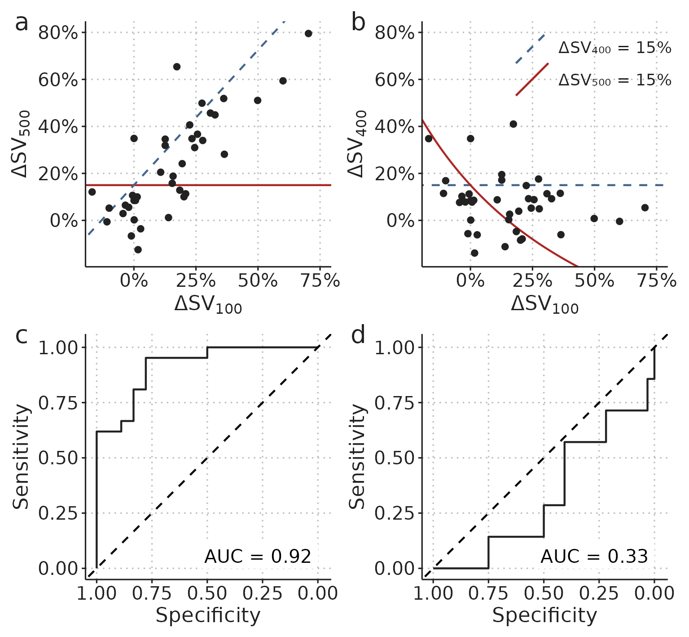
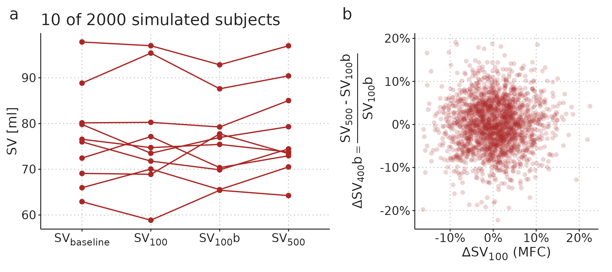
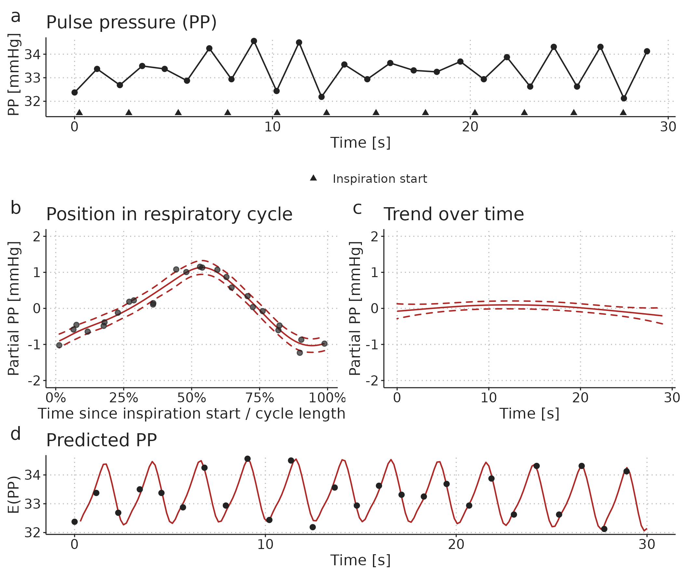
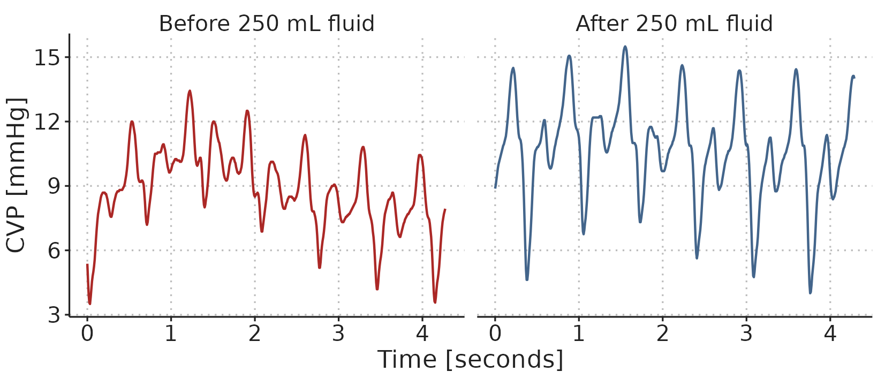
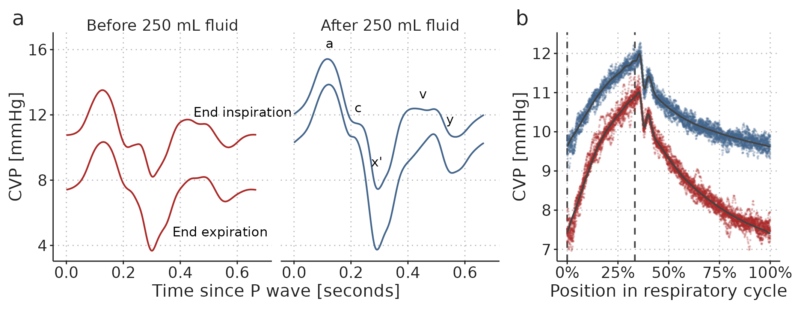
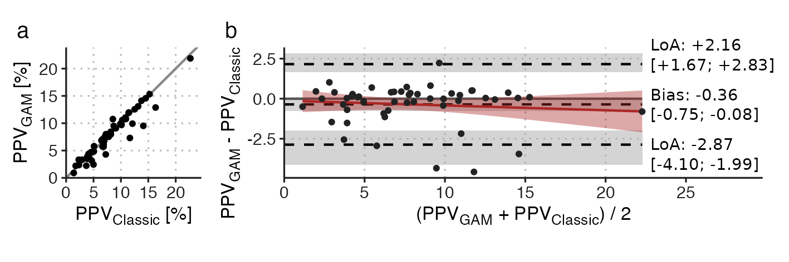
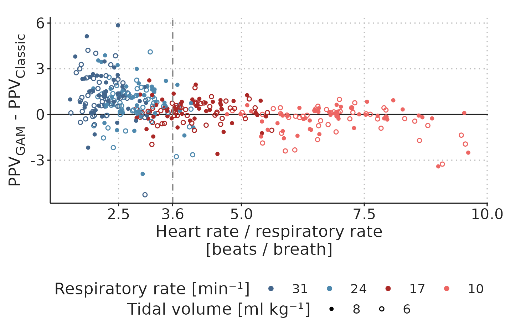
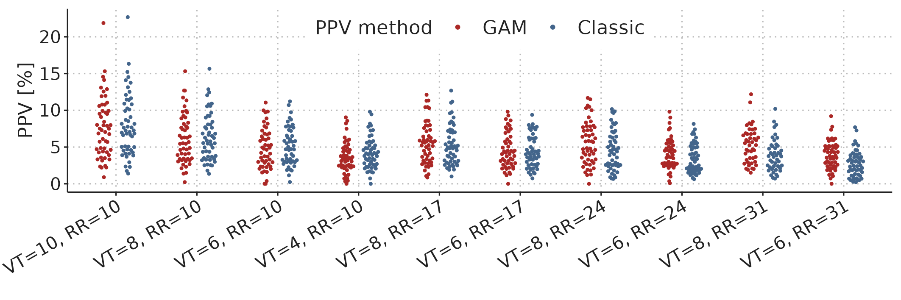
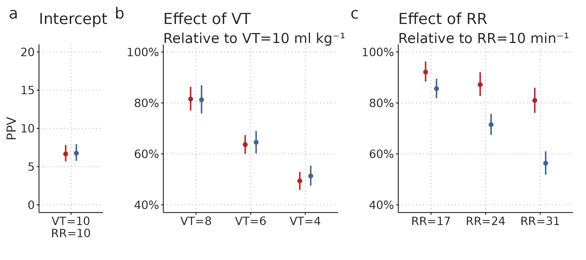

---
#########################################
# options for knitting a single chapter #
#########################################
output:
  bookdown::pdf_document2:
    template: templates/brief_template.tex
    citation_package: biblatex
  bookdown::html_document2: default
  bookdown::word_document2: default
documentclass: book
#bibliography: [bibliography/references.bib, bibliography/additional-references.bib]
---

```{block type='savequote', quote_author='(ref:ns-quote)', echo=TRUE, include=knitr::is_latex_output()}
"In statistics, the N’s justify the means."
```

(ref:ns-quote) --- **Unknown**


# Results and discussion

## Paper 1 - Most mini-fluid challenge studies overestimate predictive performance

In the reanalysis of data from the study by Muller et al., 2011 [@Muller2011], we found that the MFC predicted a response to the full fluid challenge ($\Delta SV_{500} > 15 \%$) with an area under the receiver operating characteristic curve (AUROC) of 0.92, 95%CI [0.83; 1.00] (as reported in the original study), while prediction of the response to the remaining fluid ($\Delta SV_{400} > 15 \%$) had an AUROC of 0.33 95% CI [0.11; 0.55]---i.e., worse than flipping a coin. While neither of these reflect the true predictive ability of the MFC, this analysis illustrates the importance of this design choice (see Figure \@ref(fig:results-muller-plot)).

```{r results-muller-plot}
#| out.width="13cm",
#| fig.cap="(ref:results-muller-plot)",
#| fig.scap="Alternative analysis of the results from Muller et al., 2011"

```

(ref:results-muller-plot) a) Reconstruction of fig. 3A from Muller et al., 2011 [@Muller2011]. b) The relationship between the response to ΔSV~100~ (MFC) and the response to the remaining 400 ml. c & d) Receiver operating characteristic (ROC) analysis of the ability of ΔSV~100~ (MFC) to predict a fluid response > 15% for ΔSV~500~ and ΔSV~400~ respectively.

### An improved design {#discussion-mfc}

We identify two problems in most MFC studies: First, the predictor (MFC) is included in the outcome (the response to the full fluid challenge). This is problematic because once given, the MFC cannot be withdrawn, so the outcome to evaluate should be whether the patient benefited from the subsequent fluid bolus---the intervention that, in a non-research setting, would be omitted if the MFC-response was below a certain threshold. Second and more subtly, a shared measurement error between the predictor and outcome will cause a spurious correlation. Both effects lead to an overestimation of the predictive performance of the MFC. 

The MFC study design used by Guinot et al. [@guinotMinifluidChallengePredicts2015] avoids including the predictor in the outcome by only predicting the response to the remaining 400 ml fluid, and it avoids the spurious correlation by adding a new baseline SV-measurement before administering the remaining 400 ml fluid. In Figure \@ref(fig:results-mfc-null-sim-better) we illustrate how this design does not cause a spurious correlation between predictor and outcome.

```{r results-mfc-null-sim-better}
#| out.width="100%",
#| fig.cap="(ref:results-mfc-null-sim-better)",
#| fig.scap="short caption"

```

(ref:results-mfc-null-sim-better) Extension of the simulation in Figure \@ref(fig:method-mfc-null-sim) with a second measurement of SV after the 100 ml fluid. This new baseline measurement removes the spurious correlation between predictor and outcome.

The design with a new baseline measurement is still not without problems. Essentially, we want to use the MFC response to predict whether a patient will benefit from being given the remaining fluid bolus.
However, since all patients receive both fluid boluses, we simply do not know what would happen if the remaining fluid was withheld. The implicit assumption in studies with the problematic design (with three SV measurements) is that SV would return to the baseline level if the remaining fluid was withheld, since this is the level that the final SV measurement is compared against. In the design with a new baseline measurement (used by Guinot et al. [@guinotMinifluidChallengePredicts2015]), the implicit assumption is that SV would remain at the level of the new baseline ($SV_{100}b$ in Figure \@ref(fig:results-mfc-null-sim-better)) if no further fluid challenge was given, but this may not be the case. Imagine that a subject responds to the MFC and retains this new, higher, SV after receiving the remaining fluid. This subject would be classified as a non-responder (no benefit), but it might be that in the counterfactual situation where only the MFC was given, the subject would drop in SV. In that hypothetical situation, the subject may actually have benefitted from the remaining fluid, without directly *responding* to it. By using the design by Guinot et al. [@guinotMinifluidChallengePredicts2015], we overcome an important statistical problem, but we risk classifying subjects as non-responders, who may have benefited from the remaining fluid challenge. This limitation can be reduced by waiting, e.g., 10 minutes between finishing the MFC and starting the infusion of the remaining fluid. By that time, any large but transient response to the MFC has likely faded out.

## Paper 2 - GAMs can extract PPV at ventilation with low HR/RR and decompose the information in a CVP waveform

A main aim with Paper 2 was to introduce the reader to GAMs in a practical manner. The examples in the paper may have some intriguing clinical use cases, but we did not attempt to prove any benefit over existing methods. We demonstrate that the information in steady-state recordings of PP and CVP can effectively be represented in a GAM, and that from these fitted models, we can draw inferences that are not directly available in the raw time series or waveform.

### PPV at ventilation with low HR/RR

An intriguing example of how a GAM can reveal hidden information is PPV-estimation during low heart-rate-to-respiratory-rate (HR/RR) ventilation. This is a situation where the *classical* method for PPV estimation is believed to be unreliable [@Backer2009]. In Paper 2, we fit a GAM to a time series of PP recorded while the patient is ventilated with a HR/RR of 2.17---i.e., there are just above two beats per ventilation. When the PP time series is plotted, it seems like PPV is changing (see Figure \@ref(fig:results-GAM-PP-high-rr)a). However, the cyclic effect of ventilation (Figure \@ref(fig:results-GAM-PP-high-rr)b) explains nearly all the variation in PP. From this smooth relationship between a beat’s position in the respiratory cycle and the PP created, we can calculate PPV. 

```{r results-GAM-PP-high-rr}
#| out.width="100%",
#| fig.cap="(ref:results-GAM-PP-high-rr)",
#| fig.scap="A GAM fitted to PP at low HR/RR"

```

(ref:results-GAM-PP-high-rr) Illustration of a GAM fitted to a pulse pressure (PP) time series from a patient ventilated with a low HR/RR (2.17 beats per breath). **a**) The observed time series. **b**) A smooth repeating effect of ventilation. **c**) Trend over time. **d**) The models prediction (fit): the sum of the mean PP, the effect of ventilation (**b**) and the trend over time (**c**).

### Decomposition of a CVP waveform

The second example in Paper 2 demonstrates how a GAM with just four relatively simple components can represent most of the variation in a steady-state CVP waveform. We recorded a CVP waveform before and after administration of a 250 ml fluid bolus (a short sample of the observed data is presented in Figure \@ref(fig:results-raw-CVP-fluid)). It is clear that the waveform changes with the fluid administration, but it is not easy to precisely describe this change. 

```{r results-raw-CVP-fluid}
#| out.width="14cm",
#| fig.cap="(ref:results-raw-CVP-fluid)",
#| fig.scap="CVP waveform"

```

(ref:results-raw-CVP-fluid) A sample of the CVP waveform recorded before and after administration of 250 ml fluid.

By fitting a GAM to the recorded CVP waveform, we can make inferences and visualisations that are not readily available in the raw data. A relatively simple example is the visualisation of how the shape of the CVP waveform changes with the administration of fluid, and how the effect of ventilation on the CVP waveform differs before and after fluid: Figure \@ref(fig:results-GAM-CVP-fluid)a shows the GAM-fit of the CVP through a cardiac cycle at end inspiration and end expiration, both before and after fluid. These curves do not directly exist in the observed waveforms. Both because they represent the average cardiac cycle, and because the effect of ventilation is fixed to either end expiration or end inspiration (in the observed waveform, the position in both the cardiac and respiratory cycle change continuously). 

```{r results-GAM-CVP-fluid}
#| out.width="100%",
#| fig.cap="(ref:results-GAM-CVP-fluid)",
#| fig.scap="A GAM fit of CVP before and after a fluid bolus"

```

(ref:results-GAM-CVP-fluid) Visualisation of a GAM fitted to two 60 second CVP waveforms, before and after a 250 ml fluid bolus. **a**) A cardiac cycle at two fixed positions in the respiratory cycle (end expiration and end inspiration) before and after fluid administration. **b**) The effect of ventilation alone. Coloured dots are partial residuals, illustrating the variation in data not represented in the model. Vertical, dashed, lines show end expiration and end inspiration.

The GAM is only fitted to a single subject's CVP, so the conclusions apply only to this single fluid administration in this subject. Figure \@ref(fig:results-GAM-CVP-fluid)a shows that after the fluid bolus, the variation in CVP over a cardiac cycle increased; conversely, the variation over a respiratory cycle decreased (this is especially clear in Figure \@ref(fig:results-GAM-CVP-fluid)b). The height of the $a$ wave (corresponding to the atrial contraction) was higher after fluid, and this height was less variable after fluid. The interaction between the cardiac and respiratory cycle clearly changed for the $v$ wave (the right atrial pressure before the tricuspid valve opens): the shape of the $v$ wave before and after fluid was similar at end inspiration; but at end expiration, the peak of the $v$ wave was later and higher, possibly representing ongoing venous return filling the right atrium.

Many hypotheses regarding the shape of a waveform could be investigated and formally tested from GAMs similar to this. For example, it has been proposed that the depth of the slope and depth of the $x'$ descend is related to the strength of the strength of the speed of the right ventricular contraction (similarly to the ultrasonic measure, *tricuspid annular plane systolic excursion* (TAPSE)) [@rautDescentCVPIndirect2014]. If this is the case, the respiratory variation in the $x'$ descend may represent the right ventricular response to changes in afterload, and a variable $x'$ descend could imply that increases in airway pressure (through *positive end expiratory pressure* (PEEP) or $V_T$) should be avoided. The respiratory variation in the $x'$ descend is captured in the cardiac-respiratory interaction term (illustrated in Figure \@ref(fig:method-gam-CVP)d).

## Paper 3 - There is a near-linear relationship between PPV and tidal volume

Paper 3 covers a clinical study of 52 subjects undergoing open abdominal surgery. Of these, 50 received a 250 ml fluid bolus. We had three overall aims for the study: First, we investigated the accuracy of fluid responsiveness prediction for PPV measured at different ventilator settings. Second, we compared a classic method for deriving PPV ($PPV_{Classic}$) [@Backer2009; @michardClinicalUseRespiratory1999] to the GAM derived PPV presented in Paper 2 ($PPV_{GAM}$). Third, we investigated the effect of $V_T$ and RR on PPV (*Classic* and *GAM derived*). 

### Fluid responsiveness prediction

The fluid responses observed in this study were unfortunately very minor. Only ten subjects had an increase in SV > 10%, prespecified as a significant fluid response. The low number of responders made the estimates of area under the receiver operating characteristics curves (AUROC) imprecise. For example, the AUROC for $PPV_{GAM}$ at RR=10 min^-1^, $V_T$=10 ml kg^-1^ was 0.73 95%CI [0.57; 0.90]---i.e., the data is compatible with both poor and excellent fluid responsiveness prediction. Generally, the point estimate for AUROC fell with higher RR and lower $V_T$. The results were similar for $PPV_{Classic}$.

### Comparison of $PPV_{Classic}$ and $PPV_{GAM}$

We used Bland-Altman plots to compare $PPV_{Classic}$ and $PPV_{GAM}$ for each ventilator setting. The comparison for RR=10 min^-1^, $V_T$=10 ml kg^-1^ showed good agreement between the methods, though three subjects had a $PPV_{Classic}$ that was three to five %-points higher than their $PPV_{GAM}$ (see Figure \@ref(fig:results-PPV-gam-vs-classic-1010)). These few discrepancies may reflect that $PPV_{Classic}$ is more sensitive to outlying beats, compared to $PPV_{GAM}$, which is fitted to all beats.  

```{r results-PPV-gam-vs-classic-1010}
#| out.width="14cm",
#| fig.cap="(ref:results-PPV-gam-vs-classic-1010)",
#| fig.scap="Bland-Altman plot of $PPV_{Classic}$ vs $PPV_{GAM}$"

```

(ref:results-PPV-gam-vs-classic-1010) Comparison of PPV~GAM~ and PPV~Classic~ at RR=10 min^-1^, $V_T$=10 ml kg^-1^. **a**) scatter plot; **b**) Bland-Altman plot. LoA, 95% limits of agreement. Square brackets contain 95% compatible intervals.

Lowering $V_T$ to 8 and 6 ml kg^-1^ had little impact on agreement, but at $V_T$=4 ml kg^-1^, agreement was markedly worse with a bias of -0.64, 95%CI [-1.17; -0.31], and 95% limits of agreement (LoA) from -3.71 to +2.43 (while this is similar to the LoA at RR=10 min^-1^, $V_T$=10 ml kg^-1^, the mean PPV has halved, making the relative agreement worse).

The agreement between $PPV_{Classic}$ and $PPV_{GAM}$ was lower with higher RR. This may reflect that HR/RR have different effects on $PPV_{Classic}$ and $PPV_{GAM}$. In Figure \@ref(fig:results-heart-rate-resp-rate), we present the relationship between HR/RR and the disagreement between $PPV_{Classic}$ and $PPV_{GAM}$. At high HR/RR, there was high precision and little bias. With lower HR/RR, precision decreased and $PPV_{GAM}$ was generally higher than $PPV_{Classic}$.

```{r results-heart-rate-resp-rate}
#| out.width="12cm",
#| fig.cap="(ref:results-heart-rate-resp-rate)",
# fig.scap="short caption"

```

(ref:results-heart-rate-resp-rate) Disagreement between $PPV_{Classic}$ and $PPV_{GAM}$ by HR/RR

### The effect of ventilator settings on PPV

With 52 subjects and ten ventilator settings for each, we had 520 potential windows for PPV analysis. Of these, 507 were eligible for analysis. Exclusions were due to either ≥3 extrasystoles (n=7) or because the setting with RR=31 min^-1^, $V_T$=8 ml kg^-1^ was omitted due to high airway pressure (n=4). For all eligible windows, both $PPV_{Classic}$ and $PPV_{GAM}$ were calculated (see Figure \@ref(fig:results-ppv-observed)). 

```{r results-ppv-observed}
#| out.width="100%",
#| fig.cap="(ref:results-ppv-observed)",
#| fig.scap="PPV (GAM and Classic) for all ventilator settings"

```

(ref:results-ppv-observed) PPV (GAM and Classic) for all ventilator settings in 52 subjects (n = 507 for both methods).

Figure \@ref(fig:results-mix-mod-est) show the posterior estimates for the Bayesian mixed model fitted to all 1014 PPV estimates. We see that PPV is nearly proportional to $V_T$ for both $PPV_{Classic}$ and $PPV_{GAM}$. A direct proportionality implies that PPV at $V_T$=4 ml kg^-1^ would be 40% of PPV at $V_T$=10 ml kg^-1^, but we see in Figure \@ref(fig:results-mix-mod-est)b that the expected PPV is slightly higher (approx. 50%). 

The effect of RR differs markedly between the two PPV methods: at RR=31 min^-1^, $PPV_{GAM}$ is reduced by approx. 20% while $PPV_{Classic}$ is reduced by more than 40% relative to at RR=10 min^-1^. This difference matches what we see in Figure \@ref(fig:results-heart-rate-resp-rate)---at high RR,  $PPV_{GAM}$ is generally higher than  $PPV_{Classic}$. 

```{r results-mix-mod-est}
#| out.width="12cm",
#| fig.cap="(ref:results-mix-mod-est)",
#| fig.scap="Effects of ventilator settings on PPV"

```

(ref:results-mix-mod-est) Posterior distributions (median and 95%CI) for parameters of the Bayesian mixed model fitted to PPV values for different ventilator settings. The intercept is the median PPV at RR=10 min^-1^, $V_T$=10 ml kg^-1^. The effects of RR and $V_T$ are multiplied to give the expected relative differences between the PPV at RR=10 min^-1^, $V_T$=10 ml kg^-1^ and the PPV at other ventilator settings within a single subject.

A probable explanation for the strong effect of RR on $PPV_{Classic}$ is that with high RR, we often have low HR/RR. This creates a sampling problem as visualised in Figure \@ref(fig:results-GAM-PP-high-rr), where $PPV_{Classic}$ will underestimate the "true" PPV, since only some respiratory cycles will have beats occurring at the maximum and minimum effect of ventilation; simply because there are few beats per cycle. The fall in $PPV_{GAM}$ with increasing RR may reflect a true physiologic effect of RR on PPV. It could also reflect a physiologic effect of HR/RR is present, though smaller than originally suggested by De Backer et al., 2009 [@Backer2009]. From this study, we can not determine if the effect on $PPV_{GAM}$ is from RR directly or from HR/RR.

We can use the results from this model to account for ventilator setting when interpreting PPV. The optimal PPV threshold for predicting a response to fluid seems to be around 12% at $V_T$=10 ml kg^⁻1^ [@marikDynamicChangesArterial2009]; with this $V_T$, RR will usually be around 10 min^-1^. Instead of running studies to investigate the optimal threshold for all combination of RR and $V_T$, we can use the results from our model to calculate a *best guess* for what PPV would be, if the ventilator settings were changed to RR=10 min^-1^, $V_T$=10 ml kg^-1^. As an example, if a patient is ventilated with RR=24 min⁻¹ and $V_T$=6 ml kg⁻¹, and we measure a PPV of 8% using the GAM method, we can calculate a *best guess* for  PPV at RR=10 min^-1^, $V_T$=10 ml kg^-1^ with the following formula:
$$
PPV_{RR=10,V_T=10} = 8 \% \cdot \frac{1}{0.64} \cdot \frac{1}{0.87} \approx 14 \% ,
$$
where 0.64 is the model estimate for the relative effect of ventilation with $V_T$=6 ml kg^-1^, and 0.87 is the relative effect of RR=24 min^-1^.

For practical use, we can simplify the formula for correcting PPV by simply assuming a direct proportionality between $PPV_{GAM}$ and $V_T$. The reason this approximation works is, that while PPV does not change in proportion to $V_T$, an increase in $V_T$ is usually accompanied with lowering RR to ensure normoventilation. Lowering RR happens to increase PPV by the amount needed to make PPV change in proportion to the change in $V_T$. For example, a patient, who is normoventilated at RR=10 min^-1^, $V_T$=10 ml kg^-1^, is also approximately normoventilated at RR=31 min^-1^, $V_T$=4 ml kg^-1^. The effects on PPV of these changes are 81% for the RR change and 50% for the $V_T$ change. Therefore, the combined effect of the change in ventilator settings is $81 \% \cdot 50 \% = 40.5 \%$, corresponding to a PPV change in proportion to the $V_T$ change.

### Limitations

We included patients in a period where the treating anesthesiologist expected that no hemodynamic intervention was needed in the next 15 minutes, to ensure that we could complete the study protocol without intervention. This may explain the low number of fluid responders and the correspondingly low PPV values. We do not know whether the reported effects of ventilator settings on PPV can be generalised to a more fluid responsive population with higher PPV values.

While our results provide a strong indication that the low HR/RR limitation may be overcome with the GAM method, the generally poor predictive performance of PPV in this study made a direct investigation of this impossible. It is plausible that the GAM method accurately measures PPV at low HR/RR, but this PPV is physiologically different from PPV at high HR/RR and does not reflect fluid responsiveness. 
